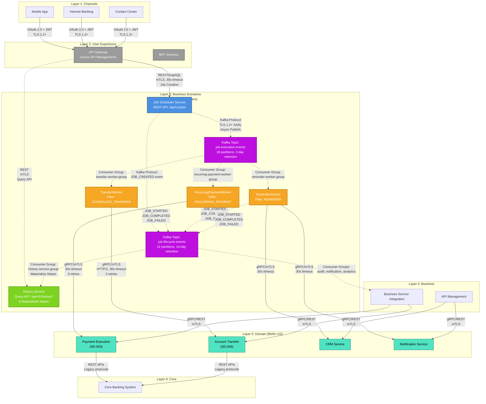

# Task Scheduling System - Intelligent Financial Operations Scheduler

> Enterprise-grade task scheduling platform enabling automated financial operations with high throughput and reliability

## Document Index

**Quick Navigation:**
- [Section 1: Executive Summary](#1-executive-summary) → Lines 25-71
- [Section 2: System Overview](#2-system-overview) → Lines 72-242
- [Section 3: Architecture Principles](#3-architecture-principles) → Lines 243-439
- [Section 4: Architecture Layers](#4-architecture-layers) → Lines 440-631
- [Section 5: Component Details](#5-component-details) → Lines 632-1280
- [Section 6: Data Flow Patterns](#6-data-flow-patterns) → Lines 1281-1474
- [Section 7: Integration Points](#7-integration-points) → Lines 1475-1835
- [Section 8: Technology Stack](#8-technology-stack) → Lines 1836-1922
- [Section 9: Security Architecture](#9-security-architecture) → Lines 1923-2170
- [Section 10: Scalability & Performance](#10-scalability--performance) → Lines 2171-2393
- [Section 11: Operational Considerations](#11-operational-considerations) → Lines 2394-2755
- [Section 12: Architecture Decision Records (ADRs)](#12-architecture-decision-records-adrs) → Lines 2756-2830

**Index Last Updated:** 2025-12-03

---

## 1. Executive Summary

### System Overview

The Task Scheduling System is an enterprise-grade scheduling platform built on Quartz Scheduler and deployed on Azure Kubernetes Service (AKS). It enables automated execution of critical financial operations including scheduled transfers, payment and transfer reminders, and recurring payments with high throughput and availability.

**Key Metrics:**

#### Write TPS
- **Average Write TPS**: 180 transactions/second (job creation)
- **Peak Write TPS**: 300 transactions/second (job creation)
- **Measurement Period**: Average over sustained operations; Peak during high-load periods

#### Processing TPS
- **Average Processing TPS**: 300 transactions/second (job execution)
- **Peak Processing TPS**: 500 transactions/second (job execution)
- **Measurement Period**: Average over sustained operations; Peak during high-load periods

#### Read TPS
- **Average Read TPS**: 200 transactions/second (job status queries)
- **Peak Read TPS**: 333 transactions/second (job status queries)
- **Measurement Period**: Average during normal operations; Peak during dashboard/reporting usage

**System Capacity:**
- **System Design Limits**: 1,000 TPS job creation (Write), 2,000 TPS job execution (Processing), 1,700 TPS queries (Read)
- **System Availability**: 99.99% uptime SLA (design target)
- **Job Execution Latency**: p95 < 100ms, p99 < 200ms (performance targets)
- **Concurrent Jobs**: Support for 10,000+ concurrent scheduled jobs

**Technology Stack:**
- Java Spring Boot, Quartz Scheduler, Azure Kubernetes Service (AKS)
- Azure SQL Database, Redis Cache, Confluent Kafka
- Prometheus/Grafana, Application Insights

**Deployment Model:**
- Multi-zone AKS cluster on Azure
- Auto-scaling based on job queue depth and CPU utilization
- Active-Active configuration with distributed job store

**Business Value:**
- **Operational Efficiency**: Automates 50,000-75,000 daily financial operations (based on 180-300 TPS sustained load)
- **Reliability**: 99.99% successful job execution rate
- **Cost Optimization**: Reduces manual processing costs by 70%
- **Compliance**: Audit trail and regulatory reporting for all scheduled operations

---

## 2. System Overview

### 2.1 Problem Statement

Financial institutions face significant challenges in managing scheduled operations:

**Business Challenges:**
- Manual processing of recurring transfers is error-prone and costly
- Payment and transfer reminders require timely execution to maintain customer satisfaction
- Scheduled payments must execute precisely on time to avoid regulatory penalties
- Peak load periods (month-end, quarter-end) create capacity bottlenecks

**Technical Challenges:**
- Existing cron-based solutions lack high availability and fault tolerance
- No centralized visibility into scheduled job status and execution history
- Difficulty scaling to handle growing volume of scheduled operations
- Limited retry and error handling capabilities

**Stakeholders Affected:**
- **Operations Teams**: Manual intervention required for failed jobs
- **Customers**: Delayed transfers and missed payment and transfer reminders
- **Compliance Officers**: Lack of audit trail for scheduled operations
- **IT Operations**: Alert fatigue from unreliable job execution

### 2.2 Solution Overview

The Task Scheduling System provides a robust, scalable platform for automating financial operations using Quartz Scheduler on Azure Kubernetes Service.

**Key Differentiators:**
- **Enterprise-Grade Reliability**: Quartz Scheduler with clustered job store ensures no job is lost
- **Cloud-Native Scalability**: AKS deployment enables horizontal scaling based on demand
- **Financial Services Optimized**: Built-in support for financial operations patterns
- **Comprehensive Observability**: Real-time monitoring and alerting for all job executions

**Core Capabilities:**
- **Job Scheduling**: Cron-based and interval-based scheduling with timezone support
- **Job Execution**: Distributed job execution across AKS pods with load balancing
- **Failure Handling**: Automatic retry with exponential backoff and dead-letter queue
- **Job Monitoring**: Real-time dashboards and alerts for job status and performance
- **Audit Trail**: Complete history of job creation, execution, and outcomes

### 2.2.1 Design Drivers

This architecture is driven by the following key factors:

#### Value Delivery
**Description**: Effectiveness of change in customer experience
- **Threshold**: >50% = High Impact, ≤50% = Low Impact
- **Current Assessment**: HIGH Impact
- **Justification**: System delivers 70% cost reduction in manual processing (Section 1, line 53)

#### Scale
**Description**: Estimated number of customers impacted
- **Threshold**: >100K = High, ≤100K = Low
- **Current Assessment**: HIGH Impact
- **Justification**: System impacts 500,000+ reminders per day (Section 2.3, line 141)

#### Impacts
**Description**: Implementation complexity across configuration, development, and applications
- **Threshold**: >5 = High, ≤5 = Low
- **Current Assessment**: HIGH Impact
- **Justification**: System requires 40+ components/technologies (Section 5: 5 components, Section 8: 35+ technologies)

**Last Calculated**: 2025-01-26
**Calculation Method**: Automatic

### 2.3 Primary Use Cases

#### Use Case 1: Scheduled Transfers

**Description**: Execute scheduled money transfers between accounts at specified dates and times

**Actors**: Customer, Transfer Service, Payment Gateway

**Flow**:
1. Customer creates scheduled transfer via mobile/web channel
2. Task Scheduling System creates Quartz job with execution schedule
3. At scheduled time, job triggers Transfer Service via API
4. Transfer Service executes transfer and publishes completion event
5. Task Scheduling System updates job status and sends customer notification

**Success Metrics**:
- 99.99% on-time execution rate
- <1% failure rate requiring manual intervention
- Average execution latency <50ms

#### Use Case 2: Payment and Transfer Reminders

**Description**: Send automated reminders to customers for upcoming scheduled payments and transfers

**Reminder Types**:
- Scheduled transfer reminders (upcoming one-time transfers)
- Recurring payment reminders (loan installments, subscriptions)
- Bill payment reminders (utility bills, credit card payments)
- Standing order execution alerts

**Actors**: Customer, Notification Service, Customer Relationship Management

**Flow**:
1. System creates reminder jobs for scheduled payments and transfers (e.g., 7 days before execution, 1 day before execution, 1 hour before execution)
2. Quartz job triggers at scheduled reminder time
3. Job retrieves customer contact preferences and transaction details from CRM
4. Notification Service sends reminder via preferred channel (email, SMS, push notification) with transaction details (amount, recipient, date)
5. Job records reminder delivery status and customer acknowledgment (if applicable)

**Success Metrics**:
- 100% reminder delivery for active scheduled payments and transfers
- <5 minute variance from scheduled reminder time
- Support for 500,000+ reminders per day
- 95% customer acknowledgment rate (for critical high-value transfers)
- Zero missed reminders for payments >$10,000

#### Use Case 3: Recurring Payments

**Description**: Execute recurring payments such as loan installments, subscriptions, and bill payments

**Actors**: Customer, Payment Service, Core Banking System

**Flow**:
1. Customer enrolls in recurring payment plan
2. Task Scheduling System creates recurring job with payment frequency
3. At each scheduled occurrence, job initiates payment transaction
4. Payment Service processes transaction and updates account balances
5. System sends payment confirmation to customer

**Success Metrics**:
- 99.95% successful payment execution rate
- Zero duplicate payments
- Automatic retry for temporary failures

#### Use Case 4: Query Job Execution History

**Description**: Channel users (mobile app, web portal) query job execution data based on custom materialized states to provide customers with real-time visibility into their scheduled transactions

**Actors**: Customer, Channel Application (Mobile/Web), User Experience Layer, History Service

**Flow**:
1. Customer opens mobile app and navigates to "My Scheduled Jobs" or "Payment History"
2. Channel application queries History Service API: `GET /api/v1/history/jobs?customerId={id}&status=UPCOMING,TODAY`
3. History Service queries JOB_EXECUTION_HISTORY table (CQRS read model) with filters on materialized_state and customer_id
4. Results cached in Redis (L2 cache) for 10 minutes to reduce database load
5. Response returned with pagination: jobs in UPCOMING/TODAY states with full execution details
6. Customer views upcoming transfers/payments with detailed status (scheduled time, amount, recipient, current state)
7. Customer can filter by date range, status, or job type to find specific transactions

**Materialized States**:
The History Service derives custom business states from standard lifecycle events:
- **ACTIVE**: Job created, scheduled more than 2 days in the future
- **UPCOMING**: Job scheduled 1-2 days before execution (advance notice)
- **TODAY**: Job scheduled for execution today
- **IN_PROGRESS**: Job currently executing (worker processing)
- **SUCCESS**: Job completed successfully (generic)
- **PAID**: Transfer or recurring payment completed successfully
- **FAILED**: Job execution failed after retries
- **EXPIRED**: Failed job displayed for 2 days, then expired (cleanup)

**Query Capabilities**:
- Query single job by jobId: `GET /api/v1/history/jobs/{jobId}`
- Query all customer jobs with pagination: `GET /api/v1/history/jobs?customerId={id}&page=0&size=20`
- Filter by materialized state: `GET /api/v1/history/jobs?status=UPCOMING,TODAY&customerId={id}`
- Filter by date range: `GET /api/v1/history/jobs?startDate=2025-12-01&endDate=2025-12-31&customerId={id}`

**Success Metrics**:
- Query latency p95 < 100ms (with cache hit)
- Query latency p99 < 500ms (cache miss, database query)
- Cache hit rate > 80%
- Support 1,000+ queries/second across all History Service pods
- Zero unauthorized access to other customers' job data

---

## 3. Architecture Principles

### 1. Separation of Concerns

**Description:**
Each component has a single, well-defined responsibility with clear boundaries between layers and modules.

**Implementation:**
- Job Scheduler component (Quartz) solely responsible for job triggering
- Job Executor component handles business logic execution independently
- Job Store (Azure SQL) manages persistence separate from execution logic
- Event Publisher component isolated from job execution concerns
- Clear API boundaries between scheduling, execution, and monitoring subsystems

**Trade-offs:**
- Multiple components increase operational complexity
- Inter-component communication requires careful interface design
- Testing requires coordination across multiple isolated components

---

### 2. High Availability

**Description:**
System remains operational during infrastructure failures through redundancy and fault tolerance, ensuring no scheduled jobs are lost or missed.

**Implementation:**
- Quartz clustered mode with shared Azure SQL job store
- Multi-zone AKS deployment with pod anti-affinity rules
- Stateless job executors enabling seamless failover
- Health checks and automatic pod restart
- Load balancer with health probes to route traffic only to healthy pods

**Trade-offs:**
- Increased infrastructure complexity and cost for redundancy
- Multi-zone deployment incurs cross-zone networking costs
- Additional operational overhead for cluster management

---

### 3. Scalability First

**Description:**
Design for horizontal scalability from day one, enabling linear capacity scaling by adding pod replicas without architectural changes.

**Implementation:**
- Stateless Spring Boot services deployed as Kubernetes Deployments
- Horizontal Pod Autoscaler (HPA) based on custom metrics (job queue depth)
- Quartz distributed execution across all pods with load balancing
- Partitioned job distribution preventing single-pod bottlenecks
- Redis cache for session data enabling stateless architecture

**Trade-offs:**
- Requires careful state management and distributed coordination
- Stateless design prohibits in-memory caching, reducing performance
- HPA configuration complexity with custom metrics

---

### 4. Security by Design

**Description:**
Security is not an afterthought but built into every layer with encryption, authentication, and authorization.

**Implementation:**
- mTLS (mutual TLS) for all internal service-to-service communication
- Azure Key Vault for secrets management (database passwords, API keys, certificates)
- Role-Based Access Control (RBAC) for job creation and management APIs
- Transparent Data Encryption (TDE) for Azure SQL job store
- Audit logging for all job operations (create, update, delete, execute)
- Network policies restricting pod-to-pod communication

**Trade-offs:**
- Performance overhead from TLS handshakes and encryption/decryption
- Increased development complexity for authentication/authorization logic
- Key rotation procedures require careful orchestration

---

### 5. Observability

**Description:**
All components emit metrics, logs, and traces to provide full visibility into system behavior and failures.

**Implementation:**
- Structured logging (JSON format) with correlation IDs for distributed tracing
- Prometheus metrics for job execution rates, latencies, and failure counts
- Grafana dashboards for real-time job status and system health monitoring
- Azure Application Insights for end-to-end transaction tracing across services
- Alerts configured for SLA violations, error rate thresholds, and queue depth
- OpenTelemetry instrumentation for trace propagation

**Trade-offs:**
- Storage and processing overhead for metrics collection (Prometheus TSDB)
- Additional infrastructure cost for Grafana, Application Insights retention
- High cardinality metrics (per-job-id) can overwhelm monitoring systems

---

### 6. Resilience

**Description:**
System degrades gracefully under failure with automatic handling of transient failures and isolation of persistent failures.

**Implementation:**
- Automatic retry with exponential backoff for failed jobs (max 3 retries)
- Circuit breakers (Hystrix/Resilience4j) for downstream service calls
- Dead-letter queue for jobs exceeding retry limits requiring manual intervention
- Job execution timeout (configurable per job type) to prevent resource exhaustion
- Bulkhead pattern isolating job execution pools by priority

**Trade-offs:**
- Increased complexity in error handling logic and retry state management
- Potential for delayed failure detection due to retry attempts
- Circuit breaker tuning requires careful analysis of failure patterns

---

### 7. Simplicity

**Description:**
Choose the simplest solution that meets requirements, avoiding over-engineering and unnecessary complexity.

**Implementation:**
- Quartz Scheduler selected over building custom scheduler (mature, battle-tested)
- Standard Spring Boot framework instead of reactive/non-blocking (team familiarity)
- REST APIs instead of gRPC for internal communication (debugging simplicity)
- Azure SQL as job store instead of distributed databases (ACID guarantees, operational simplicity)
- Minimalist job data model (no premature optimization with complex schemas)

**Trade-offs:**
- May require refactoring as scale requirements grow beyond single-region deployment
- REST overhead higher than gRPC for high-volume inter-service communication
- Azure SQL vertical scaling limits compared to distributed databases

---

### 8. Cloud-Native

**Description:**
Design for cloud deployment and orchestration, leveraging Azure cloud platform capabilities.

**Implementation:**
- Containerized Spring Boot services deployed on Azure Kubernetes Service (AKS)
- Azure SQL Database (PaaS) instead of self-managed databases
- Azure Key Vault for secrets instead of file-based configuration
- Azure Monitor and Application Insights for native cloud observability
- Infrastructure as Code using Terraform for AKS cluster and Azure resources
- Adherence to 12-factor app principles (externalized config, stateless processes)

**Trade-offs:**
- Potential vendor lock-in to Azure-specific services (Key Vault, Application Insights)
- Cloud provider dependency for availability and performance
- Azure region limitations for multi-region deployment

---

### 9. Open Standards

**Description:**
Prefer open standards over proprietary solutions to ensure interoperability and avoid vendor lock-in.

**Implementation:**
- REST/HTTP for API communication (OpenAPI 3.0 specification)
- Prometheus metrics format (industry-standard for Kubernetes)
- OpenTelemetry for distributed tracing (vendor-neutral)
- Quartz Scheduler (open-source, widely adopted standard)
- Confluent Kafka for event streaming (based on Apache Kafka open standard)
- Standard JDBC for database connectivity

**Trade-offs:**
- May miss Azure-specific optimizations (e.g., Azure Service Bus features)
- Open standards sometimes lag behind proprietary innovations
- Multi-vendor compatibility testing required

---

### 10. Event-Driven Architecture

**Description:**
Loose coupling via domain events instead of synchronous coupling, enabling asynchronous communication patterns.

**Implementation:**
- Publish domain events to Confluent Kafka on job completion and failure
- Consumer groups process events asynchronously with offset management for exactly-once semantics
- Idempotent event handlers to safely handle duplicate messages
- Event sourcing for job execution history with 30-day Kafka topic retention
- Schema Registry for event schema versioning and compatibility

**Trade-offs:**
- Eventual consistency requires careful handling in business logic
- Increased debugging complexity for event-driven flows
- Message ordering challenges when processing events in parallel
- Kafka cluster operational overhead (ZooKeeper coordination, replication)

---

## 4. Architecture Layers

**Architecture Type**: META Architecture (6-layer enterprise model)

The Task Scheduling System is positioned within the **Business Scenarios** layer of the META Architecture, orchestrating cross-cutting business flows that integrate capabilities from multiple domains.

**Deployment Architecture**: The system is deployed on Azure Kubernetes Service (AKS) for high availability and horizontal scalability. See [ADR-002](adr/ADR-002-aks-deployment.md) for the selection rationale of AKS as the deployment platform. For multi-region deployment strategy, see Section 11.3 (Disaster Recovery).

---

### Layer Positioning

| Layer | Function | Task Scheduling Role |
|-------|----------|---------------------|
| **Channels** | User touchpoints (web, mobile, ATMs) | Receives job creation requests from channels |
| **User Experience** | Orchestrates user experiences | Routes job status queries and notifications |
| **Business Scenarios** | **Cross-cutting business flows** | **Orchestrates scheduled execution of transfers, reminders, payments** |
| **Business** | Business capabilities and APIs | Provides business service integration |
| **Domain** | BIAN Service Domains implementation | Consumes Payment, Transfer, Notification domains |
| **Core** | Core banking and legacy systems | Triggered indirectly via Domain services |

#### Layer Selection Rationale

The Task Scheduling System is positioned in the **Business Scenarios** layer rather than Domain layer because:

**Cross-Domain Orchestration**:
- Coordinates Payment Execution (BIAN SD-003), Funds Transfer (BIAN SD-045), and Customer Notifications domains
- Scheduling is not domain-specific but spans multiple business domains

**Business Process Focus**:
- Implements time-based business workflows (not domain entities)
- Manages temporal concerns (scheduling, timing, recurring execution) that are cross-cutting

**BIAN Alignment**:
- Scheduling doesn't map to a single BIAN Service Domain but orchestrates multiple domains
- Provides scenario-level orchestration that composes domain services

This positioning enables:
- Loose coupling from domain services via events and APIs
- Independent scaling of scheduling infrastructure
- Reusability across multiple business domains (transfers, payments, notifications)
- Clear separation between scheduling logic and domain business logic

---

### Integration with Other Layers

#### Inbound Communication (From Upper Layers)

**From Channels Layer**:
- Customer-initiated job creation (schedule a transfer)
- Job status inquiries
- Job cancellation requests

**Protocol**: REST APIs via API Gateway (OAuth 2.0 + JWT authentication, TLS 1.2+)

**Communication Characteristics**:
- Timeout: 30 seconds for job creation requests
- Circuit breaker: Opens after 5 consecutive failures
- Rate limiting: 100 requests/minute per API key

#### Outbound Communication (To Lower Layers)

**To Kafka (Event-Driven Architecture)**:
- Job execution requests published to Kafka → Independent worker microservices consume and execute
- Protocol: Kafka protocol over TLS 1.2+ with SASL authentication
- Topic: `job-execution-events` (18 partitions, 3-day retention, see Section 5.6)
- Partition strategy: Hash by jobType for load distribution
- Message format: Avro (Confluent Schema Registry for schema evolution)

**Job Execution Events Published**:
- Event type: Job execution requests (SCHEDULED_TRANSFER, REMINDER, RECURRING_PAYMENT)
- Event contains: jobId, jobType, scheduled time, parameters, execution context, correlation ID
- Guarantees: At-least-once delivery, idempotent producers
- Timeout: 5-10ms publish latency (non-blocking async)

**Worker Microservices** (consume job-execution-events):
- **TransferWorker**: Processes SCHEDULED_TRANSFER jobs → Calls Funds Transfer Service (BIAN SD-045)
- **ReminderWorker**: Processes REMINDER jobs → Calls CRM + Notification Service
- **RecurringPaymentWorker**: Processes RECURRING_PAYMENT jobs → Calls Payment Service (BIAN SD-003) + schedules next occurrence

**Worker → Domain Service Integration**:
- Protocol: REST/gRPC synchronous calls (HTTP/2 with mTLS)
- Timeout: 30 seconds per service call with circuit breaker protection
- Circuit breaker threshold: 5 consecutive failures
- Retry policy: 3 attempts with exponential backoff (2s, 4s, 8s)
- Error handling: Transient errors retried, business errors sent to dead-letter queue

**History Service** (Query API for Channel Users):
- Consumes `job-lifecycle-events` (JOB_CREATED from Scheduler, JOB_STARTED/JOB_COMPLETED/JOB_FAILED from Workers)
- Materializes custom business states: ACTIVE, UPCOMING, TODAY, IN_PROGRESS, SUCCESS, PAID, FAILED, EXPIRED
- Provides REST Query API at `/api/v1/history/*` endpoints for channel applications
- CQRS read model stored in `JOB_EXECUTION_HISTORY` table (separate from Quartz tables)
- Two-level caching: L1 (Caffeine in-memory, 5min TTL), L2 (Redis distributed, 10min TTL)
- Performance: p50=20ms, p95=100ms query latency with 80%+ cache hit rate
- Supports 2,000 queries/sec peak throughput across all pods
- See Section 5.5 for detailed component documentation

**Lifecycle Events** (Unified Event Topic):
- Scheduler publishes JOB_CREATED to `job-lifecycle-events` when job is created
- Workers publish JOB_STARTED, JOB_COMPLETED, JOB_FAILED to `job-lifecycle-events` during execution
- Topic retention: 14 days (see Section 5.8)
- Consumer groups:
  - `history-service-group`: Materializes custom states for query API
  - `audit-service-group`: Compliance and audit trail
  - `notification-service-group`: Customer notifications
  - `analytics-service-group`: Reporting and dashboards

---

### Architecture Diagram



**Diagram Legend**:

**Arrow Types**:
- **Solid arrows (→)**: Synchronous calls (REST/gRPC with mTLS)
- **Dashed arrows (-.->)**: Asynchronous events (Kafka publish/subscribe)

**Security Protocols**:
- **OAuth 2.0 + JWT**: Channel authentication
- **mTLS**: Mutual TLS for internal service-to-service communication
- **TLS 1.2+**: Transport layer encryption
- **SASL**: Kafka authentication (Simple Authentication and Security Layer)

**Timeouts & Retries**:
- **30s timeout**: Standard timeout for synchronous REST/gRPC calls
- **3 retries**: Exponential backoff (2s, 4s, 8s) for transient failures
- **Circuit Breaker**: Opens after 5 consecutive failures

**Component Colors**:
- **Blue**: Job Scheduler Service (entry point for job creation)
- **Orange**: Worker Microservices (execution layer)
- **Green**: History Service (query/read model with CQRS)
- **Purple**: Kafka Topics (event streaming backbone)
- **Teal**: Domain Services (BIAN v12 Service Domains)
- **Gray**: API Gateway (infrastructure layer)

**Kafka Consumer Groups**:
- `transfer-worker-group`, `reminder-worker-group`, `recurring-payment-worker-group`: Consume job-execution-events filtered by job type
- `history-service-group`: Consumes job-lifecycle-events for state materialization (ACTIVE, UPCOMING, TODAY, IN_PROGRESS, SUCCESS, PAID, FAILED, EXPIRED)
- `audit-service-group`, `notification-service-group`, `analytics-service-group`: Consume job-lifecycle-events for downstream processing

**Data Flow Patterns**:
- **Job Creation Flow**: Channels → API Gateway → Job Scheduler → Kafka (job-execution-events) → Workers
- **Job Execution Flow**: Workers consume events → Call Domain Services → Publish lifecycle events → Kafka (job-lifecycle-events)
- **State Materialization Flow**: Kafka (job-lifecycle-events) → History Service → Materialize custom states → CQRS read model
- **Query Flow**: Channels → API Gateway → History Service → Query API response

---

## 5. Component Details

### 5.1 Job Scheduler Service

**Type**: Microservice (Clustered)
**Technology**: Java 17, Spring Boot 3.2, Quartz Scheduler 2.3
**Version**: v1.0.0
**Location**: `services/task-scheduler/`

**Purpose**:
Lightweight event publisher that triggers scheduled jobs by publishing execution events to Kafka. Workers consume events asynchronously and execute jobs independently.

**Architectural Decisions**: See [ADR-001](adr/ADR-001-quartz-scheduler.md) for the selection rationale of Quartz Scheduler as the job scheduling engine.

**Responsibilities**:
- Accept job creation requests via REST API
- Persist job definitions and schedules to Azure SQL job store
- Trigger job execution at scheduled times using Quartz
- Publish job execution events to Kafka (`job-execution-events` topic)
- Publish job dispatch status events to Kafka (`job-status-events` topic)
- Coordinate distributed locking across multiple pod instances using Redis
- Provide job query and management API

**APIs/Interfaces**:
- **REST API**: `/api/v1/jobs/*` for job management (create, update, delete, query)
  - `POST /api/v1/jobs` - Create scheduled job
  - `GET /api/v1/jobs/{jobId}` - Get job details
  - `PUT /api/v1/jobs/{jobId}` - Update job schedule
  - `DELETE /api/v1/jobs/{jobId}` - Cancel job
  - `GET /api/v1/jobs/{jobId}/executions` - Get execution history
- **Quartz Scheduler**: Internal job execution framework
- **Event Publishing**: Confluent Kafka topics for job events

**Dependencies**:
- **Depends on**:
  - Azure SQL Database (Quartz job store)
  - Redis Cache (distributed locking, idempotency)
  - Confluent Kafka (event publishing to job-execution-events and job-lifecycle-events topics)
- **Depended by**:
  - User Experience Layer (BFF services)
  - Worker Microservices (consume execution events)
  - History Service (consumes job-lifecycle-events)
  - Monitoring services (metrics collection)

**Configuration**:
- `QUARTZ_INSTANCE_NAME`: Unique instance identifier (default: auto-generated)
- `QUARTZ_THREAD_POOL_SIZE`: Worker thread pool size (default: 20)
- `JOB_MISFIRE_THRESHOLD`: Misfire threshold in milliseconds (default: 60000)
- `AZURE_SQL_CONNECTION`: Job store database connection string (required)
- `REDIS_CONNECTION`: Redis cache connection string (required)

**Scaling**:
- **Horizontal**: Stateless service, scales to 15 pods maximum (reduced from 30, lighter workload)
- **Vertical**: 2 vCPU, 4GB RAM per pod (standard), 4 vCPU, 8GB RAM (peak)
- **Auto-scaling**: HPA based on job queue depth > 1000 or CPU > 70%

**Failure Modes**:
- **Database unavailable**: Service enters degraded state, cannot accept new jobs, Quartz misfires scheduled jobs until database recovers
- **Redis unavailable**: Falls back to database-based locking (slower but functional), duplicate dispatch protection degrades
- **Kafka cluster unavailable**: Events buffered in producer memory (up to 32MB) and published on reconnection, job execution delayed
- **Event publishing timeout**: Retry with exponential backoff, job remains in Quartz for retry at next fire time

**Monitoring**:
- **Key Metrics**:
  - Job creation rate (TPS)
  - Job execution rate (TPS)
  - Job execution latency (p50, p95, p99)
  - Failed job rate
  - Job queue depth
  - Active thread pool utilization
- **Alerts**:
  - Job creation latency > 500ms (p99)
  - Failed job rate > 1%
  - Job queue depth > 3000
  - Database connection pool exhaustion
- **Logs**: All job lifecycle events, execution results, errors with correlation IDs

---

### 5.2 TransferWorker Microservice

**Type**: Microservice (Stateless Event Consumer)
**Technology**: Java 17, Spring Boot 3.2, Spring Kafka, Resilience4j
**Version**: v1.0.0
**Location**: `services/transfer-worker/`

**Purpose**:
Execute scheduled transfers by consuming job execution events from Kafka and invoking Funds Transfer Service (BIAN SD-045).

**Responsibilities**:
- Consume job-execution-events from Kafka (filter by jobType=SCHEDULED_TRANSFER)
- Invoke Funds Transfer Service with transfer parameters
- Handle transient failures with retry logic and circuit breaker
- Publish lifecycle events to job-lifecycle-events topic (JOB_STARTED, JOB_COMPLETED, JOB_FAILED)
- Maintain idempotency to prevent duplicate transfer execution

**APIs/Interfaces**:
- **Kafka Consumer**: Consumes from `job-execution-events` topic (filters SCHEDULED_TRANSFER)
- **Kafka Producer**: Publishes to `job-lifecycle-events` topic
- **Outbound gRPC**: Calls Funds Transfer Service (BIAN SD-045) via gRPC/mTLS
- **Redis**: Idempotency checks (processed event cache)

**Dependencies**:
- **Depends on**:
  - Confluent Kafka (event consumption and publishing)
  - Funds Transfer Service (BIAN SD-045) - domain service
  - Redis Cache (idempotency tracking)
  - Application Insights (distributed tracing)
- **Depended by**: History Service (consumes job-lifecycle-events)

**Configuration**:
- `KAFKA_CONSUMER_GROUP`: transfer-worker-group
- `KAFKA_CONSUMER_CONCURRENCY`: 10 (concurrent consumers per pod)
- `KAFKA_MAX_POLL_RECORDS`: 50 (batch size)
- `JOB_EXECUTION_TIMEOUT`: 30000ms (30 seconds)
- `RETRY_MAX_ATTEMPTS`: 3
- `RETRY_BACKOFF_MS`: 2000, 4000, 8000 (exponential backoff)
- `CIRCUIT_BREAKER_THRESHOLD`: 5 consecutive failures

**Scaling**:
- **Horizontal**: 3-15 pods (HPA based on Kafka consumer lag and CPU)
- **Vertical**: 2 vCPU, 4GB RAM per pod (standard), 4 vCPU, 8GB RAM (peak)
- **Auto-scaling Trigger**: Consumer lag > 1000 messages OR CPU > 70%

**Failure Modes**:
- **Kafka unavailable**: Consumer paused, resumes on reconnection, no data loss
- **Transfer Service unavailable**: Circuit breaker opens, events retried with exponential backoff
- **Timeout**: Execution terminated after 30s, status=FAILED published, event sent to DLQ
- **Duplicate event**: Idempotency check prevents duplicate execution, event acknowledged

**Monitoring**:
- **Key Metrics**:
  - Consumer lag (messages behind latest offset)
  - Transfer execution success rate
  - Transfer execution duration (p50, p95, p99)
  - Circuit breaker state (open/closed)
  - Idempotency cache hit rate
- **Alerts**:
  - Consumer lag > 5000 messages for 10 minutes
  - Transfer success rate < 99.5%
  - Circuit breaker open for Funds Transfer Service
- **Logs**: Execution logs with correlation IDs, masked account numbers

---

### 5.3 ReminderWorker Microservice

**Type**: Microservice (Stateless Event Consumer)
**Technology**: Java 17, Spring Boot 3.2, Spring Kafka, Resilience4j
**Version**: v1.0.0
**Location**: `services/reminder-worker/`

**Purpose**:
Send payment and transfer reminders to customers by consuming reminder job events and invoking CRM and Notification services.

**Responsibilities**:
- Consume job-execution-events from Kafka (filter by jobType=REMINDER)
- Retrieve customer contact preferences from CRM Service
- Send reminders via Notification Service (email, SMS, push)
- Handle transient failures with retry logic
- Publish lifecycle events to job-lifecycle-events topic (JOB_STARTED, JOB_COMPLETED, JOB_FAILED)
- Support batching for high-volume reminder processing

**APIs/Interfaces**:
- **Kafka Consumer**: Consumes from `job-execution-events` topic (filters REMINDER)
- **Kafka Producer**: Publishes to `job-lifecycle-events` topic
- **Outbound REST**: Calls CRM Service and Notification Service via REST/mTLS
- **Redis**: Idempotency checks

**Dependencies**:
- **Depends on**:
  - Confluent Kafka (event consumption and publishing)
  - CRM Service (customer contact preferences)
  - Notification Service (email, SMS, push delivery)
  - Redis Cache (idempotency tracking)
  - Application Insights (distributed tracing)
- **Depended by**: History Service (consumes job-lifecycle-events)

**Configuration**:
- `KAFKA_CONSUMER_GROUP`: reminder-worker-group
- `KAFKA_CONSUMER_CONCURRENCY`: 10
- `KAFKA_MAX_POLL_RECORDS`: 100 (higher for batch processing)
- `BATCH_SIZE`: 50 (reminders batched for notification service)
- `JOB_EXECUTION_TIMEOUT`: 30000ms
- `RETRY_MAX_ATTEMPTS`: 3
- `CIRCUIT_BREAKER_THRESHOLD`: 5

**Performance Characteristics**:
- **Processing Time per Reminder**:
  - Average (p50): 200ms
  - Worst case (p99): 500ms
- **Processing Breakdown**:
  - Idempotency check (Redis): 2ms
  - CRM Service call (gRPC/mTLS): 80-250ms
    - Network latency: 2-5ms
    - CRM processing: 60-200ms
    - Response serialization: 3-10ms
  - Notification Service call (gRPC/mTLS): 100-230ms
    - Network latency: 2-5ms
    - Notification delivery: 90-200ms (email/SMS/push)
    - Response serialization: 3-10ms
  - Lifecycle event publishing: 5-10ms
  - Kafka offset commit: 2-5ms
- **Batch Processing**: 50 reminders per batch enables parallel processing

**Scaling**:
- **Horizontal**: 2-10 pods (HPA based on consumer lag and CPU)
- **Vertical**: 2 vCPU, 4GB RAM per pod
- **Auto-scaling Trigger**: Consumer lag > 2000 messages OR CPU > 70%

**Failure Modes**:
- **Kafka unavailable**: Consumer paused, resumes on reconnection
- **CRM/Notification Service unavailable**: Circuit breaker opens, retry with backoff
- **Timeout**: Reminder marked as failed, event sent to DLQ for manual review
- **Duplicate event**: Idempotency check prevents duplicate reminder delivery

**Monitoring**:
- **Key Metrics**:
  - Consumer lag
  - Reminder delivery success rate
  - Reminder processing time (p50, p95, p99)
  - CRM Service call latency
  - Notification Service call latency
  - Circuit breaker state
  - Batch processing throughput (reminders/second)
- **Alerts**:
  - Consumer lag > 10,000 messages (high reminder volume)
  - Reminder delivery success rate < 99%
  - Circuit breaker open for Notification Service
- **Logs**: Reminder delivery logs with customer ID (masked PII)

---

### 5.4 RecurringPaymentWorker Microservice

**Type**: Microservice (Stateless Event Consumer)
**Technology**: Java 17, Spring Boot 3.2, Spring Kafka, Resilience4j
**Version**: v1.0.0
**Location**: `services/recurring-payment-worker/`

**Purpose**:
Execute recurring payments (loan installments, subscriptions) and schedule next occurrence by consuming payment job events.

**Responsibilities**:
- Consume job-execution-events from Kafka (filter by jobType=RECURRING_PAYMENT)
- Invoke Payment Execution Service (BIAN SD-003) to process payment
- Schedule next occurrence via Scheduler API (POST /api/v1/jobs)
- Handle transient failures with retry logic
- Publish lifecycle events to job-lifecycle-events topic (JOB_STARTED, JOB_COMPLETED, JOB_FAILED)
- Prevent duplicate payments via idempotency checks

**APIs/Interfaces**:
- **Kafka Consumer**: Consumes from `job-execution-events` topic (filters RECURRING_PAYMENT)
- **Kafka Producer**: Publishes to `job-lifecycle-events` topic
- **Outbound gRPC**: Calls Payment Execution Service (BIAN SD-003) via gRPC/mTLS
- **Outbound REST**: Calls Job Scheduler Service API to schedule next occurrence
- **Redis**: Idempotency checks

**Dependencies**:
- **Depends on**:
  - Confluent Kafka (event consumption and publishing)
  - Payment Execution Service (BIAN SD-003) - domain service
  - Job Scheduler Service (schedule next occurrence)
  - Redis Cache (idempotency tracking)
  - Application Insights (distributed tracing)
- **Depended by**: History Service (consumes job-lifecycle-events)

**Configuration**:
- `KAFKA_CONSUMER_GROUP`: recurring-payment-worker-group
- `KAFKA_CONSUMER_CONCURRENCY`: 6
- `KAFKA_MAX_POLL_RECORDS`: 50
- `JOB_EXECUTION_TIMEOUT`: 30000ms
- `RETRY_MAX_ATTEMPTS`: 3
- `RETRY_BACKOFF_MS`: 2000, 4000, 8000
- `CIRCUIT_BREAKER_THRESHOLD`: 5
- `SCHEDULER_API_URL`: http://task-scheduler.svc.cluster.local:8080

**Performance Characteristics**:
- **Processing Time per Recurring Payment**:
  - Average (p50): 600ms
  - Worst case (p99): 1500ms (1.5 seconds)
- **Processing Breakdown**:
  - Idempotency check (Redis): 2ms
  - Payment Execution Service call (gRPC/mTLS): 500-1400ms
    - Network latency: 2-5ms
    - Payment processing (BIAN SD-003): 450-1300ms
      - Payment validation: 50-150ms
      - Payment execution: 350-1000ms
      - Payment confirmation: 50-150ms
    - Response serialization: 3-10ms
  - Next occurrence scheduling (Scheduler API): 80-100ms
    - Network latency: 2-5ms
    - API processing: 70-90ms
    - Response handling: 3-5ms
  - Lifecycle event publishing: 5-10ms
  - Kafka offset commit: 2-5ms
- **Note**: Longer processing time due to payment execution complexity and next occurrence scheduling

**Scaling**:
- **Horizontal**: 2-8 pods (HPA based on consumer lag and CPU)
- **Vertical**: 2 vCPU, 4GB RAM per pod
- **Auto-scaling Trigger**: Consumer lag > 1000 messages OR CPU > 70%

**Failure Modes**:
- **Kafka unavailable**: Consumer paused, resumes on reconnection
- **Payment Service unavailable**: Circuit breaker opens, retry with backoff
- **Scheduler API unavailable**: Next occurrence scheduling fails, alert triggered for manual intervention
- **Timeout**: Payment marked as failed, event sent to DLQ
- **Duplicate event**: Idempotency check prevents duplicate payment execution

**Monitoring**:
- **Key Metrics**:
  - Consumer lag
  - Payment execution success rate
  - Payment processing time (p50, p95, p99)
  - Payment Execution Service call latency
  - Next occurrence scheduling latency
  - Next occurrence scheduling success rate
  - Circuit breaker state
- **Alerts**:
  - Consumer lag > 5000 messages
  - Payment success rate < 99.5%
  - Circuit breaker open for Payment Service
  - Next occurrence scheduling failures > 1%
- **Logs**: Payment execution logs with correlation IDs, masked account/payment details

---

### 5.5 History Service

**Type**: Microservice (Event Consumer + Query API)
**Technology**: Java 17, Spring Boot 3.2, Spring Kafka, JDBC, Spring Web, Spring Cache (Caffeine), Spring Data Redis
**Version**: v1.0.0
**Location**: `services/history-service/`

**Purpose**:
Materialize custom business states from lifecycle events and provide query API for channel users to retrieve job execution data with high performance.

**Responsibilities**:
1. **Event Processing**:
   - Consume job-lifecycle-events from Kafka (JOB_CREATED, JOB_STARTED, JOB_COMPLETED, JOB_FAILED, JOB_CANCELLED)
   - Derive materialized states based on event type, job type, and timestamps
   - Persist materialized view to JOB_EXECUTION_HISTORY table (CQRS read model)
   - Handle idempotency (duplicate events via Redis deduplication cache)
   - Handle out-of-order events (optimistic locking with version column)
2. **Query API**:
   - Provide REST API for channel users to query job execution data
   - Support filtering by jobId, customerId, materialized state, date range
   - Pagination for large result sets (default 20, max 100 items/page)
   - Two-level caching for query performance (L1: Caffeine, L2: Redis)
   - Authorization: Customers can only query their own jobs (customerId JWT claim validation)
3. **State Materialization**:
   - Calculate time-based states (ACTIVE → UPCOMING → TODAY based on scheduled time)
   - Calculate completion states (JOB_COMPLETED → SUCCESS or PAID based on job type)
   - Calculate expiration states (FAILED → EXPIRED after 2 days)
   - Run scheduled job daily at midnight to refresh time-dependent states
   - Maintain state transition audit trail (last_event_id, last_event_time, state_updated_at)

**Custom Materialized States**:

| State | Derived From | Derivation Logic |
|-------|--------------|------------------|
| ACTIVE | JOB_CREATED | Job created, scheduled >2 days in future |
| UPCOMING | JOB_CREATED + scheduledTime | 1-2 days before scheduled execution |
| TODAY | JOB_CREATED + scheduledTime | Current date matches scheduled execution date |
| IN_PROGRESS | JOB_STARTED | Job execution started by worker |
| SUCCESS | JOB_COMPLETED + success=true | Job completed successfully (generic) |
| PAID | JOB_COMPLETED + jobType=SCHEDULED_TRANSFER/RECURRING_PAYMENT | Transfer or payment completed successfully |
| FAILED | JOB_FAILED | Job execution failed after retries |
| EXPIRED | JOB_FAILED + 2 days elapsed | Failed job displayed for 2 days, then expired |

**APIs/Interfaces**:

- **Kafka Consumer**:
  - Topic: `job-lifecycle-events`
  - Consumer Group: `history-service-group`
  - Event Types: JOB_CREATED, JOB_STARTED, JOB_COMPLETED, JOB_FAILED, JOB_CANCELLED
  - Concurrency: 8 consumer threads per pod

- **REST API**:
  - `GET /api/v1/history/jobs/{jobId}` - Get single job by ID
  - `GET /api/v1/history/jobs?customerId={id}&page={n}&size={m}` - Query jobs with pagination
  - `GET /api/v1/history/jobs?status={state1,state2}&customerId={id}` - Filter by materialized state(s)
  - `GET /api/v1/history/jobs?startDate={date}&endDate={date}&customerId={id}` - Filter by date range
  - Protocol: REST/JSON over HTTP (internal) or HTTPS (external via API Gateway)
  - Authentication: OAuth 2.0 + JWT (inherited from API Gateway)
  - Authorization: customerId claim in JWT must match query parameter

- **Database**: JDBC connection to Azure SQL (JOB_EXECUTION_HISTORY table)
- **Cache**: L1 (Caffeine in-memory, 5min TTL), L2 (Redis distributed, 10min TTL)
- **Health Check**: Spring Boot Actuator endpoints for monitoring

**Dependencies**:
- **Depends on**:
  - Confluent Kafka (event consumption from job-lifecycle-events)
  - Azure SQL Database (JOB_EXECUTION_HISTORY table read/write)
  - Redis (L2 cache + idempotency deduplication)
  - Application Insights (distributed tracing)
- **Depended by**: Channel Applications (mobile app, web portal via API Gateway)

**Configuration**:
```yaml
spring:
  kafka:
    consumer:
      group-id: history-service-group
      concurrency: 8
      max-poll-records: 100
      enable-auto-commit: false
  datasource:
    hikari:
      maximum-pool-size: 30
  cache:
    caffeine:
      spec: maximumSize=10000,expireAfterWrite=5m

history:
  cache:
    l1-ttl-minutes: 5
    l2-ttl-minutes: 10
  query:
    max-page-size: 100
    default-page-size: 20
  state-refresh:
    cron: "0 0 0 * * *"  # Daily at midnight
```

**Database Schema**:
```sql
-- CQRS Read Model: JOB_EXECUTION_HISTORY
CREATE TABLE JOB_EXECUTION_HISTORY (
    id BIGINT PRIMARY KEY IDENTITY(1,1),
    job_id VARCHAR(36) NOT NULL UNIQUE,
    correlation_id VARCHAR(36) NOT NULL,

    -- Job metadata
    customer_id VARCHAR(50) NOT NULL,
    job_type VARCHAR(50) NOT NULL,  -- SCHEDULED_TRANSFER, REMINDER, RECURRING_PAYMENT

    -- Scheduling info
    scheduled_time TIMESTAMP NOT NULL,
    created_at TIMESTAMP NOT NULL DEFAULT CURRENT_TIMESTAMP,

    -- Execution info
    execution_start_time TIMESTAMP NULL,
    execution_end_time TIMESTAMP NULL,
    execution_duration_ms INT NULL,

    -- Materialized state (custom business state)
    materialized_state VARCHAR(20) NOT NULL,  -- ACTIVE, UPCOMING, TODAY, IN_PROGRESS, SUCCESS, PAID, FAILED, EXPIRED
    state_updated_at TIMESTAMP NOT NULL DEFAULT CURRENT_TIMESTAMP,

    -- Execution result
    success BOOLEAN NULL,
    error_message TEXT NULL,
    error_code VARCHAR(50) NULL,
    retry_count INT DEFAULT 0,

    -- Worker metadata
    worker_id VARCHAR(100) NULL,
    worker_type VARCHAR(50) NULL,

    -- Transaction details (for transfers/payments)
    transaction_id VARCHAR(50) NULL,
    source_account VARCHAR(50) NULL,
    destination_account VARCHAR(50) NULL,
    amount DECIMAL(18,2) NULL,
    currency VARCHAR(3) NULL,

    -- Audit fields
    last_event_id VARCHAR(36) NOT NULL,
    last_event_time TIMESTAMP NOT NULL,
    version INT DEFAULT 0,  -- Optimistic locking

    -- Query performance indexes
    INDEX idx_customer_state (customer_id, materialized_state, scheduled_time DESC),
    INDEX idx_state_scheduled (materialized_state, scheduled_time DESC),
    INDEX idx_customer_daterange (customer_id, scheduled_time DESC),
    INDEX idx_correlation (correlation_id)
);
```

**Scaling**:
- **Horizontal**: 3-8 pods (HPA based on consumer lag + HTTP request rate)
- **Vertical**: 2 vCPU, 4GB RAM per pod (handles both event processing and query API)
- **Auto-scaling Triggers**:
  - Kafka consumer lag > 5,000 messages
  - HTTP request rate > 100 req/sec per pod
  - CPU > 70%
- **Cache Scaling**: Redis cluster (3 nodes, 6GB RAM each) for L2 cache

**Failure Modes**:
- **Kafka unavailable**: Consumer paused, state updates delayed but not lost (events retained in Kafka)
- **Database unavailable**: Events buffered in Kafka, queries return 503 Service Unavailable
- **Redis unavailable**: L2 cache miss, queries fall back to database (higher latency)
- **Optimistic lock conflict**: Retry update with fresh version number, skip if event already processed
- **Duplicate event**: Idempotency check (Redis deduplication cache) prevents duplicate state updates
- **Out-of-order events**: Optimistic locking ensures latest event wins, stale events ignored
- **Query API overload**: Rate limiting (100 req/min per customer) via API Gateway

**Monitoring**:
- **Key Metrics**:
  - Event processing rate (events/sec)
  - State materialization latency (p50, p95, p99)
  - Query API latency (p50, p95, p99)
  - Query cache hit rate (L1 and L2)
  - Consumer lag
  - Database connection pool utilization
  - HTTP request rate and error rate
- **Alerts**:
  - Consumer lag > 10,000 messages (state updates delayed)
  - Query API p95 latency > 100ms (performance degradation)
  - Cache hit rate < 80% (cache ineffective)
  - State refresh job failures (time-based states not updating)
  - Database connection pool > 90%
  - HTTP error rate > 1%
- **Logs**:
  - Event processing logs with job ID, event type, materialized state transition, correlation IDs
  - Query API access logs with customer ID, query parameters, response time, cache hit/miss
  - State refresh job logs with updated counts (ACTIVE→UPCOMING, UPCOMING→TODAY, FAILED→EXPIRED)

---

### 5.6 Azure SQL Job Store

**Type**: Database (Managed PaaS)
**Technology**: Azure SQL Database (General Purpose tier)
**Version**: SQL Server 2022 compatible
**Location**: Azure region (primary), paired region (replica)

**Purpose**:
Persistent storage for Quartz job definitions, triggers, schedules, and execution state with high availability.

**Architectural Decisions**: See [ADR-003](adr/ADR-003-azure-sql-job-store.md) for the selection rationale of Azure SQL Database as the Quartz job store.

**Responsibilities**:
- Store job and trigger definitions
- Maintain job execution state across cluster
- Provide pessimistic locking for distributed job execution
- Support clustered Quartz scheduler instances
- Enable job execution history queries

**Schema**:
- Quartz standard tables: `QRTZ_JOB_DETAILS`, `QRTZ_TRIGGERS`, `QRTZ_CRON_TRIGGERS`, `QRTZ_FIRED_TRIGGERS`
- Custom tables: `JOB_EXECUTION_HISTORY`, `JOB_AUDIT_LOG`

**Configuration**:
- **DTU/vCore**: General Purpose 8 vCores (current provisioning; review for potential downsizing to 6 vCores based on actual load monitoring)
- **Storage**: 500GB with auto-growth
- **Backup**: Automated daily backups, 35-day retention
- **Geo-Replication**: Active geo-replication to paired region

**Scaling**:
- **Vertical**: Can scale from 4 vCores to 16 vCores based on DTU utilization (32 vCores maximum for future growth beyond current projections)
- **Read Replicas**: Optional read replica for reporting queries

**Failure Modes**:
- **Primary region failure**: Automatic failover to geo-replica (RPO <5 minutes, RTO <30 seconds)
- **Connection pool exhaustion**: Applications receive connection errors, auto-retry logic activates

**Monitoring**:
- **Key Metrics**: DTU utilization, connection count, query latency, deadlocks
- **Alerts**: DTU > 80%, connection pool > 90%, query latency > 200ms
- **Logs**: Slow query log, deadlock traces

---

### 5.7 Redis Cache (Distributed Lock Manager)

**Type**: Cache (Managed PaaS)
**Technology**: Azure Managed Redis (Memory Optimized M10)
**Version**: Redis 7.4
**Location**: Azure region with zone redundancy

**Purpose**:
Provide distributed locking to prevent duplicate job execution and cache frequently accessed job metadata.

**Responsibilities**:
- Distributed locks for job execution coordination
- Cache job metadata to reduce database queries
- Session storage for API authentication tokens
- Rate limiting counters for job creation API

**Data Structures**:
- **Locks**: `job:lock:{jobId}` with TTL
- **Cache**: `job:metadata:{jobId}` with 5-minute TTL
- **Counters**: `ratelimit:{apiKey}:{minute}` with 1-minute TTL

**Configuration**:
- **Tier**: Memory Optimized M10 (10GB, 25,000 ops/sec)
- **Port**: 10000 (TLS encrypted)
- **Authentication**: Microsoft Entra ID with access policies
- **Persistence**: RDB snapshots every 15 minutes
- **Max Memory Policy**: allkeys-lru (evict least recently used)

**Scaling**:
- **Vertical**: Scale from M10 to M20 (20GB) based on memory utilization
- **No downtime**: Scaling operations complete without service interruption

**Failure Modes**:
- **Cache unavailable**: Application falls back to database-based locking (degraded performance)
- **Memory pressure**: LRU eviction of cached metadata, no data loss

**Monitoring**:
- **Key Metrics**: Memory utilization, cache hit rate, connected clients, operations/sec
- **Alerts**: Memory > 80%, cache hit rate < 90%, connection errors
- **Logs**: Slow operations, eviction events

---

### 5.8 Confluent Kafka (Event Publisher)

**Type**: Distributed Event Streaming Platform
**Technology**: Confluent Kafka (Confluent Cloud or Self-Managed)
**Version**: Apache Kafka 3.6+ / Confluent Platform 7.5+
**Location**: Multi-zone deployment with cross-region replication

**Purpose**:
Reliable, ordered delivery of job execution commands, status updates, and lifecycle events with high throughput and low latency. Serves as the central event backbone for asynchronous job processing, decoupling scheduler from workers and enabling independent scaling.

**Responsibilities**:
- Publish job execution events from Scheduler to Worker microservices (job-execution-events topic)
- Publish job lifecycle events from Scheduler and Workers to downstream subscribers (job-lifecycle-events topic)
- Guarantee at-least-once delivery to all consumers
- Maintain event ordering per job (partition key = jobId for lifecycle events, jobType for execution events)
- Retain events for replay, audit, and debugging purposes
- Support multiple consumer groups for different processing patterns (event materialization, audit, notifications, analytics)
- Provide schema validation via Confluent Schema Registry (Avro format)

**Topics and Consumer Groups**:

- **Topic 1**: `job-execution-events` *(NEW - Async Job Execution)*
  - **Purpose**: Job execution requests from Scheduler to Worker microservices
  - **Partitions**: 18 (higher than lifecycle events for execution throughput)
  - **Replication Factor**: 3
  - **Retention**: 3 days (259200000ms)
  - **Partition Key**: `jobType` (SCHEDULED_TRANSFER, REMINDER, RECURRING_PAYMENT)
  - **Format**: Avro (Confluent Schema Registry)
  - **Consumer Groups**:
    - `transfer-worker-group` (filters jobType=SCHEDULED_TRANSFER, concurrency=10)
    - `reminder-worker-group` (filters jobType=REMINDER, concurrency=8)
    - `recurring-payment-worker-group` (filters jobType=RECURRING_PAYMENT, concurrency=6)
  - **Publishers**: Job Scheduler Service (publishes on job trigger)
  - **Event Schema Fields**: eventId, eventTime, jobId, jobType, scheduledTime, parameters (customerId, accounts, amount, etc.), executionContext (correlationId, retryCount, timeout, priority)

- **Topic 2**: `job-lifecycle-events` *(Unified Event Topic)*
  - **Purpose**: Single source of truth for all job lifecycle events - powers state materialization, audit trail, notifications, and analytics
  - **Partitions**: 12 (for parallelism)
  - **Replication Factor**: 3
  - **Retention**: 14 days (1209600000ms)
  - **Partition Key**: `jobId` (ensures event ordering per job)
  - **Format**: Avro (Confluent Schema Registry)
  - **Consumer Groups**:
    - `history-service-group` (materializes custom business states, powers query API, concurrency=8)
    - `audit-service-group` (compliance and audit trail, all events)
    - `notification-service-group` (customer notifications, completed events with filtering)
    - `analytics-service-group` (reporting and dashboards, all events with batch processing)
  - **Publishers**:
    - Job Scheduler Service (JOB_CREATED when job is created)
    - Worker microservices - TransferWorker, ReminderWorker, RecurringPaymentWorker (JOB_STARTED, JOB_COMPLETED, JOB_FAILED during execution)
  - **Event Types**: JOB_CREATED, JOB_STARTED, JOB_COMPLETED, JOB_FAILED, JOB_CANCELLED
  - **Event Schema Fields**: eventId, eventTime, jobId, jobType, eventType, customerId, scheduledTime, executionStartTime, executionEndTime, executionDuration, success, errorMessage, errorCode, retryCount, workerId, workerType, transactionId, correlationId

**Configuration**:
- **Retention Period**: 14 days (log.retention.hours=336)
- **Max message size**: 1 MB (max.message.bytes=1048576)
- **Compression**: lz4 (for network efficiency)
- **Idempotence**: Enabled (enable.idempotence=true)
- **Acks**: all (acks=all for durability)
- **Min In-Sync Replicas**: 2 (min.insync.replicas=2)

**Scaling**:
- **Throughput**: 10,000+ messages/sec (horizontally scalable with partitions)
- **Auto-scaling**: Dynamic partition rebalancing, consumer group auto-scaling based on lag
- **Partitioning Strategy**: Hash-based on jobId for ordering guarantees

**Failure Modes**:
- **Kafka cluster unavailable**: Messages buffered in producer (buffer.memory=33554432), exponential backoff retry
- **Consumer unavailable**: Messages remain in topic, offset not committed, reprocessed on consumer restart
- **Broker failure**: Automatic leader election, replica promotion ensures availability

**Monitoring**:
- **Key Metrics**: Producer send rate, consumer lag, partition leadership distribution, under-replicated partitions
- **Alerts**: Consumer lag > 10,000 messages, under-replicated partitions detected, producer errors > 1%
- **Logs**: Message send failures, consumer rebalance events, offset commit failures
- **Tools**: Confluent Control Center, Prometheus JMX Exporter, Grafana dashboards

---

## 6. Data Flow Patterns

### 6.1 Scheduled Transfer Creation Flow

**Trigger**: Customer schedules a future transfer via mobile app

**Actors**: Customer, Channels Layer, User Experience Layer, Task Scheduling System, Domain Layer

**High-Level Flow**:
1. Customer submits scheduled transfer request via mobile app
2. API Gateway validates and routes to Transfer BFF (User Experience Layer)
3. Transfer BFF creates job via Task Scheduling System API (`POST /api/v1/jobs`)
4. Task Scheduling System persists job to Azure SQL (Quartz tables) and caches metadata in Redis
5. Response returned with job ID and next execution time
6. Customer receives confirmation

**Key Data Exchanges**:
- **Input**: Transfer details (accounts, amount, schedule, recurrence)
- **Output**: Job ID, status, next execution time
- **Protocols**: REST/JSON between layers

**Error Handling**:
- Validation failures (insufficient balance, invalid schedule) → HTTP 400
- Database unavailable → HTTP 503 with exponential backoff retry
- Idempotency keys prevent duplicate job creation

**Performance**: p50 = 30ms, p95 = 80ms, p99 = 150ms | Write TPS: 180 avg, 300 peak (job creation)

**Details**: See API documentation for complete request/response schemas

---

### 6.2 Job Execution Flow (Async Event-Driven)

**Trigger**: Quartz Scheduler detects scheduled time reached

**Actors**: Job Scheduler Service, Confluent Kafka, Worker Microservices (TransferWorker, ReminderWorker, RecurringPaymentWorker), History Service, Domain Services

**High-Level Flow**:

**Phase 1: Event Publishing (Scheduler → Kafka)**
1. Quartz acquires distributed lock (Redis) for job dispatch (prevents duplicate dispatch)
2. Job Scheduler builds job execution event from Quartz JobDataMap
3. Scheduler publishes execution event to Kafka topic `job-execution-events` (partition by jobType)
4. Scheduler publishes lifecycle event (JOB_CREATED) to Kafka topic `job-lifecycle-events` (partition by jobId)
5. Scheduler releases distributed lock immediately (non-blocking, <10ms)
6. Quartz marks job as dispatched and schedules next fire time (if recurring)

**Phase 2: Event Consumption & Execution (Kafka → Workers)**
7. Worker microservice consumes execution event from Kafka
   - TransferWorker filters jobType=SCHEDULED_TRANSFER
   - ReminderWorker filters jobType=REMINDER
   - RecurringPaymentWorker filters jobType=RECURRING_PAYMENT
8. Worker performs idempotency check (Redis cache, prevents duplicate execution)
9. Worker publishes lifecycle event (JOB_STARTED) to `job-lifecycle-events`
10. Worker calls target domain service via gRPC/mTLS:
    - TransferWorker → Funds Transfer Service (BIAN SD-045)
    - ReminderWorker → CRM + Notification Service
    - RecurringPaymentWorker → Payment Execution Service (BIAN SD-003)
11. Domain service executes business logic and returns result
12. Worker publishes lifecycle event (JOB_COMPLETED or JOB_FAILED) to `job-lifecycle-events` with execution result
13. Worker acknowledges Kafka message (commits offset)

**Phase 3: State Materialization (Kafka → History Service)**
14. History Service consumes lifecycle events from `job-lifecycle-events` topic
15. Derives materialized state based on event type and business rules:
    - JOB_CREATED → ACTIVE/UPCOMING/TODAY (based on scheduledTime relative to current date)
    - JOB_STARTED → IN_PROGRESS
    - JOB_COMPLETED → SUCCESS or PAID (based on jobType: SCHEDULED_TRANSFER/RECURRING_PAYMENT → PAID, others → SUCCESS)
    - JOB_FAILED → FAILED
    - Daily scheduled job: ACTIVE → UPCOMING (1-2 days before), UPCOMING/ACTIVE → TODAY (current date), FAILED → EXPIRED (after 2 days)
16. Updates JOB_EXECUTION_HISTORY table (CQRS read model) with optimistic locking (version column)
17. Invalidates cache entries for affected customer/jobId (L1: Caffeine, L2: Redis)
18. Acknowledges Kafka message

**Phase 4: Downstream Processing (Kafka → Audit/Notification/Analytics)**
19. Downstream consumers process lifecycle events asynchronously from `job-lifecycle-events` topic:
    - Audit Service (audit-service-group): Compliance and regulatory audit trail
    - Notification Service (notification-service-group): Customer notifications for completed jobs
    - Analytics Service (analytics-service-group): Reporting and dashboards

**Key Data Exchanges**:
- **Scheduler → Kafka**: Avro-encoded job execution events to `job-execution-events` (eventId, jobId, jobType, parameters, executionContext) + Avro-encoded lifecycle events to `job-lifecycle-events` (JOB_CREATED)
- **Workers → Kafka**: Avro-encoded lifecycle events to `job-lifecycle-events` (JOB_STARTED, JOB_COMPLETED, JOB_FAILED with execution result, worker metadata)
- **Workers → Domain Services**: Protobuf (gRPC) for Transfer/Payment services, JSON (REST) for CRM/Notification
- **History Service → Azure SQL**: JDBC updates to JOB_EXECUTION_HISTORY table with optimistic locking (version column)

**Latency Breakdown**:
```
Scheduler Event Publishing (Phase 1): p50 = 10ms, p95 = 50ms, p99 = 100ms
├─ Lock acquisition (Redis): 2ms
├─ Event serialization (Avro): 1ms
├─ Kafka producer send (2 topics): 5ms (async, non-blocking)
└─ Lock release: 2ms

Worker Execution (Phase 2): p50 = 34ms, p95 = 100ms, p99 = 200ms
├─ Kafka consumption lag: <1ms (steady state)
├─ Idempotency check (Redis): 2ms
├─ Domain service call (gRPC): 25ms
│  ├─ Network latency: 2ms
│  ├─ Service processing: 20ms
│  └─ Response serialization: 3ms
├─ Lifecycle event publishing: 2ms
└─ Kafka offset commit: 2ms

State Materialization (Phase 3): p50 = 15ms, p95 = 50ms, p99 = 100ms
├─ Kafka consumption: 5ms
├─ State derivation logic: 1ms
├─ Database update (JOB_EXECUTION_HISTORY): 7ms
├─ Cache invalidation (L1 + L2): 1ms
└─ Offset commit: 1ms

Total End-to-End Latency: p50 = 59ms, p95 = 200ms, p99 = 400ms
(Scheduler dispatch + Worker execution + State materialization)
```

**Performance Characteristics**:
- **Scheduler Throughput**: 3,000 TPS (event publishing capacity, non-blocking)
- **Worker Throughput**: 8,000+ TPS aggregate (scales independently per worker type)
  - TransferWorker: 3,000 TPS (3-15 pods × 10 concurrency)
  - ReminderWorker: 320-800 TPS (2-10 pods × 8 concurrency, 200-500ms per reminder)
    - Base scale (2 pods): 80 reminders/sec (40,000 reminders in ~8-10 minutes)
    - Peak scale (10 pods): 400 reminders/sec (40,000 reminders in ~1.7-2 minutes)
  - RecurringPaymentWorker: 32-320 TPS (2-8 pods × 6 concurrency, 600-1500ms per payment)
    - Base scale (2 pods): 20 payments/sec (10,000 payments in ~8-9 minutes)
    - Peak scale (8 pods): 80 payments/sec (10,000 payments in ~2-3 minutes)
- **History Service Throughput**: 10,000 TPS (event materialization + query API)
  - Event processing: 8,000 TPS (lightweight state derivation + database updates)
  - Query API: 2,000 TPS (with 80%+ cache hit rate)

**Error Handling**:

**Scheduler Errors**:
- **Kafka unavailable**: Events buffered in producer memory (32MB buffer), exponential backoff retry (max 3 attempts)
- **Event publishing timeout**: Job remains in Quartz for retry at next fire time, alert triggered
- **Duplicate dispatch**: Redis lock prevents duplicate events, idempotent producer ensures exactly-once publishing

**Worker Errors**:
- **Transient errors (HTTP 503, timeout, network failure)**: Retry with exponential backoff (2s, 4s, 8s), max 3 attempts
- **Business errors (HTTP 400, insufficient funds, validation failure)**: No retry, status=FAILED, event sent to DLQ
- **Circuit breaker open**: Worker pauses consumption, publishes status=FAILED after timeout
- **Max retries exceeded**: Event sent to dead-letter queue (`job-execution-dlq`), high-severity alert triggered
- **Duplicate event**: Idempotency check (Redis cache) prevents duplicate execution, event acknowledged

**History Service Errors**:
- **Database unavailable**: Events buffered in Kafka (14-day retention), processed when database recovers, queries return 503 Service Unavailable
- **Redis cache unavailable**: L2 cache miss, queries fall back to database (higher latency), event processing continues
- **Optimistic lock conflict**: Retry update with fresh version number, skip if event already processed
- **Duplicate event**: Idempotency check (Redis deduplication cache) prevents duplicate state updates
- **Out-of-order events**: Optimistic locking ensures latest event wins based on version number
- **Query API overload**: Rate limiting (100 req/min per customer) enforced by API Gateway
- **Connection pool exhaustion**: Backpressure applied, consumer slows down

**Concurrency & Race Conditions**:
- **Duplicate Dispatch**: Redis distributed lock (60s TTL) prevents multiple scheduler pods from dispatching same job
- **Duplicate Execution**: Redis idempotency cache (7-day TTL) prevents workers from executing duplicate events
- **Status Update Race**: Optimistic locking (version column) prevents concurrent status overwrites
- **Kafka Rebalance**: Workers gracefully pause during rebalance, resume consumption after partition assignment

**Monitoring & Observability**:
- **Correlation ID**: Propagated through all events (eventId → correlationId) for distributed tracing
- **Key Metrics**:
  - Scheduler: Event publish rate, publish latency, Kafka producer error rate
  - Workers: Consumer lag, execution success rate, execution duration, circuit breaker state
  - History Service: Consumer lag, state materialization latency, query API latency, cache hit rate, event processing rate
  - End-to-End: Job dispatch → completion latency (via correlation ID matching)
- **Distributed Tracing**: Application Insights traces span Scheduler → Kafka → Worker → Domain Service → History Service

**Details**: See sequence diagrams in `/docs/flows/async-job-execution-flow.md` for detailed interactions

---

### 6.3 Job Failure and Retry Flow

**Trigger**: Job execution fails due to transient error

**Actors**: Job Executor, Retry Manager, Alerting Service

**High-Level Flow**:
1. Job Executor detects execution failure (timeout, service unavailable)
2. Failure recorded in Azure SQL job history
3. Retry policy evaluated (max 3 attempts with exponential backoff)
4. Job rescheduled with calculated delay
5. Failure event published to Kafka
6. On final failure: Job moved to dead-letter queue, high-severity alert triggered

**Retry Policy**:
- Max attempts: 3
- Backoff: Exponential (2s, 4s, 8s)
- Retry on: Transient errors (timeouts, HTTP 503, network issues)
- No retry on: Business errors (HTTP 400, validation failures)

**Monitoring**: Retry rate, retry success rate, dead-letter queue depth

**Details**: See runbook `/docs/runbooks/job-retry-handling.md`

---

## 7. Integration Points

### Summary

The Task Scheduling System integrates with four primary external systems: Azure SQL (job store), Redis (distributed locking), Confluent Kafka (event streaming), and domain services (payment execution). All integrations use encrypted protocols, managed authentication, and comprehensive monitoring.

**Integration Summary Table**:

| System | Protocol | Purpose | SLA | Monthly Cost | Documentation |
|--------|----------|---------|-----|--------------|---------------|
| Azure SQL Database | JDBC/TLS 1.2 | Quartz job store, execution history | 99.99% | $1,200 | [Azure SQL Docs](https://docs.microsoft.com/en-us/azure/azure-sql/) |
| Azure Managed Redis | RESP/TLS | Distributed locks, caching, rate limiting | 99.99% | $500 | [Redis Docs](https://learn.microsoft.com/en-us/azure/redis/) |
| Confluent Kafka | Kafka/TLS | Job lifecycle events pub/sub | 99.99% | $700 | [Confluent Docs](https://docs.confluent.io/) |
| Payment Execution (BIAN SD-003) | gRPC/mTLS | Transfer and payment execution | 99.99% | Internal | Internal API docs |

---

### 7.1 Data Layer Integrations

**Azure SQL Database** (Job Store):
- **Endpoint**: `task-scheduler-db.database.windows.net:1433` (primary), read replica available
- **Authentication**: Azure AD Managed Identity (preferred)
- **Configuration**: 8 vCores General Purpose, geo-replicated, connection pool (10-50 per pod)
- **Key Operations**: Job persistence, trigger scheduling, execution state management, lock acquisition
- **Failover**: Automatic geo-replica promotion (RTO <30s, RPO <5min)
- **Details**: See [ADR-003](adr/ADR-003-azure-sql-job-store.md)

**Azure Managed Redis** (Distributed Lock Manager):
- **Endpoint**: `task-scheduler-cache.redis.azure.net:10000`
- **Configuration**: Memory Optimized M10 (10GB, 25,000 ops/sec), zone-redundant, LRU eviction
- **Key Operations**: Distributed locks (`SET NX EX`), job metadata caching, rate limiting counters
- **Degradation**: Falls back to database-based locking on Redis unavailability
- **Cache Strategy**: L1 (Caffeine in-memory) + L2 (Redis distributed), >90% hit rate target
- **Details**: See [ADR-005](adr/ADR-005-redis-distributed-locking.md)

---

### 7.2 Event Streaming Integration

**Confluent Kafka** (Event Streaming Platform):
- **Endpoint**: `pkc-xxxxx.region.azure.confluent.cloud:9092`
- **Authentication**: SASL/PLAIN with API keys (Azure Key Vault managed)
- **Protocol**: Kafka protocol over TLS 1.2+ with SASL authentication
- **Schema Format**: Avro (Confluent Schema Registry for schema validation and versioning)
- **Guarantees**: At-least-once delivery, ordered per partition key, idempotent producers
- **Configuration**: Compression (lz4), acks=all, max message 1MB, min.insync.replicas=2
- **Monitoring**: Consumer lag, producer error rate, partition health via Confluent Control Center

**Topics Overview**:

The system uses two Kafka topics for different purposes:
1. **job-execution-events**: Job execution requests (Scheduler → Workers)
2. **job-lifecycle-events**: Unified event topic for state materialization, audit trail, notifications, and analytics (Scheduler/Workers → History Service, Audit, Notification, Analytics)

---

#### Topic 1: job-execution-events (Async Job Execution)

**Purpose**: Job execution requests from Job Scheduler Service to Worker microservices

**Configuration**:
- **Partitions**: 18 (higher throughput for execution events)
- **Replication Factor**: 3
- **Retention**: 3 days (259200000ms)
- **Partition Key**: `jobType` (SCHEDULED_TRANSFER, REMINDER, RECURRING_PAYMENT)
- **Partition Strategy**: Hash-based on jobType for load distribution across workers

**Publishers**:
- Job Scheduler Service (publishes on job trigger from Quartz)

**Consumer Groups**:
- `transfer-worker-group` (filters jobType=SCHEDULED_TRANSFER, concurrency=10)
- `reminder-worker-group` (filters jobType=REMINDER, concurrency=8)
- `recurring-payment-worker-group` (filters jobType=RECURRING_PAYMENT, concurrency=6)

**Event Schema** (Avro):
```json
{
  "eventId": "uuid",
  "eventTime": "timestamp-millis",
  "jobId": "string",
  "jobType": "enum[SCHEDULED_TRANSFER, REMINDER, RECURRING_PAYMENT]",
  "scheduledTime": "timestamp-millis",
  "parameters": {
    "customerId": "string",
    "sourceAccount": "string | null",
    "destinationAccount": "string | null",
    "amount": "string | null",
    "currency": "string | null",
    "reminderType": "string | null",
    "notificationChannel": "string | null",
    "recurringFrequency": "string | null",
    "additionalData": "map<string, string> | null"
  },
  "executionContext": {
    "correlationId": "string",
    "retryCount": "int",
    "maxRetries": "int",
    "timeout": "int",
    "priority": "string | null"
  },
  "schemaVersion": "string"
}
```

**Message Flow**:
1. Scheduler publishes execution event on job trigger
2. Workers consume based on jobType filter
3. Workers perform idempotency check (Redis cache)
4. Workers execute job and publish status events

**Monitoring**:
- Producer send rate from Scheduler
- Consumer lag per worker group (alert if >5000 messages)
- Partition distribution (ensure even load across partitions)

---

#### Topic 2: job-lifecycle-events (Unified Event Topic)

**Purpose**: Single source of truth for all job lifecycle events - powers state materialization, audit trail, notifications, and analytics

**Configuration**:
- **Partitions**: 12
- **Replication Factor**: 3
- **Retention**: 14 days (1209600000ms)
- **Partition Key**: `jobId` (ensures event ordering per job)
- **Partition Strategy**: Hash-based on jobId

**Publishers**:
- Job Scheduler Service (publishes JOB_CREATED when job is created)
- Worker microservices - TransferWorker, ReminderWorker, RecurringPaymentWorker (publish JOB_STARTED, JOB_COMPLETED, JOB_FAILED during execution)

**Consumer Groups**:
- `history-service-group` (materializes custom business states, powers query API, concurrency=8)
- `audit-service-group` (compliance and regulatory audit trail, all events)
- `notification-service-group` (customer notifications, completed/failed events with filtering)
- `analytics-service-group` (reporting and dashboards, all events with batch processing)

**Event Types**:
- **JOB_CREATED**: Published by Scheduler when job is created and scheduled
- **JOB_STARTED**: Published by Worker when job execution begins
- **JOB_COMPLETED**: Published by Worker when job execution succeeds
- **JOB_FAILED**: Published by Worker when job execution fails after retries
- **JOB_CANCELLED**: Published by Scheduler when job is cancelled by user

**Event Schema** (Avro):
```json
{
  "eventId": "uuid",
  "eventTime": "timestamp-millis",
  "eventType": "enum[JOB_CREATED, JOB_STARTED, JOB_COMPLETED, JOB_FAILED, JOB_CANCELLED]",
  "jobId": "string",
  "correlationId": "string",
  "customerId": "string",
  "jobType": "enum[SCHEDULED_TRANSFER, REMINDER, RECURRING_PAYMENT]",
  "scheduledTime": "timestamp-millis",
  "executionStartTime": "timestamp-millis | null",
  "executionEndTime": "timestamp-millis | null",
  "executionDuration": "long | null",
  "success": "boolean | null",
  "errorMessage": "string | null",
  "errorCode": "string | null",
  "retryCount": "int",
  "workerId": "string | null",
  "workerType": "string | null",
  "transactionId": "string | null",
  "schemaVersion": "string"
}
```

**Message Flow**:
1. Scheduler publishes JOB_CREATED when job is scheduled
2. Worker publishes JOB_STARTED when execution begins
3. Worker publishes JOB_COMPLETED/JOB_FAILED based on execution result with full execution details
4. History Service consumes all events and materializes custom business states (ACTIVE, UPCOMING, TODAY, IN_PROGRESS, SUCCESS, PAID, FAILED, EXPIRED)
5. Downstream services (Audit, Notification, Analytics) consume events asynchronously

**State Materialization by History Service**:
- JOB_CREATED → ACTIVE/UPCOMING/TODAY (based on scheduledTime)
- JOB_STARTED → IN_PROGRESS
- JOB_COMPLETED → SUCCESS or PAID (based on jobType)
- JOB_FAILED → FAILED
- Daily job: ACTIVE → UPCOMING → TODAY, FAILED → EXPIRED

**Monitoring**:
- Consumer lag per group (alert if history-service-group lag > 10,000 messages)
- Event publishing rate from Scheduler and Workers
- History Service state materialization latency (p95 < 50ms)
- Downstream processing success rate per consumer group

---

**Common Kafka Configuration**:
- **Producer Configuration**:
  - `enable.idempotence=true` (prevent duplicate events)
  - `acks=all` (wait for all replicas to acknowledge)
  - `compression.type=lz4` (network efficiency)
  - `linger.ms=10` (batch events for efficiency)
  - `batch.size=16384` (16KB batch size)
  - `buffer.memory=33554432` (32MB producer buffer)

- **Consumer Configuration**:
  - `enable.auto.commit=false` (manual offset management)
  - `max.poll.records=50-100` (batch size varies by worker type)
  - `session.timeout.ms=30000` (30s session timeout)
  - `heartbeat.interval.ms=10000` (10s heartbeat)
  - `isolation.level=read_committed` (read only committed messages)

**Dead Letter Queue**:
- **Topic**: `job-execution-dlq`
- **Purpose**: Failed events after max retries
- **Partitions**: 6
- **Retention**: 30 days (manual investigation required)
- **Consumers**: Operations team monitoring dashboard

**Error Handling**:
- **Transient Errors**: Automatic retry with exponential backoff
- **Schema Validation Errors**: Events rejected at producer (fail fast)
- **Consumer Failures**: Events remain in topic, reprocessed on consumer restart
- **Kafka Unavailable**: Producer buffers events (32MB buffer), publishes on reconnection

---

### 7.3 History Service Query API

**History Service** (Job Execution Query API):
- **Endpoint**: `history-service.svc.cluster.local:8080/api/v1/history/*`
- **Protocol**: REST/JSON over HTTP (internal) or HTTPS (external via API Gateway)
- **Authentication**: OAuth 2.0 + JWT (inherited from API Gateway for external access)
- **Authorization**: Customer can only query their own jobs (customerId claim in JWT must match query parameter)
- **Rate Limiting**: 100 requests/minute per customer (enforced by API Gateway)
- **Caching Strategy**: Two-level caching (L1: Caffeine in-memory 5min, L2: Redis distributed 10min)
- **Query Patterns**: Single job by ID, customer jobs with pagination, filter by state/date range

**API Operations**:

1. **Get Job by ID**: `GET /api/v1/history/jobs/{jobId}`
   - **Purpose**: Retrieve single job execution details with current materialized state
   - **Authorization**: JWT customerId must match job's customerId
   - **Response**: JobExecutionHistoryDTO (jobId, customerId, jobType, materializedState, scheduledTime, executionStartTime, executionEndTime, executionDuration, success, errorMessage, errorCode, workerId, transactionId, amount, currency)
   - **Latency**: p50=5ms (L1 cache hit), p95=30ms (L2 cache hit), p99=100ms (database query)
   - **Caching**: L1 (Caffeine) + L2 (Redis), cache invalidated on state change
   - **Error Responses**:
     - 404 Not Found: Job ID does not exist
     - 403 Forbidden: Customer attempting to access another customer's job
     - 503 Service Unavailable: Database or cache unavailable

2. **Query Jobs by Customer**: `GET /api/v1/history/jobs?customerId={id}&page={n}&size={m}`
   - **Purpose**: Retrieve all jobs for a customer with pagination
   - **Query Parameters**:
     - `customerId` (required): Customer identifier
     - `page` (optional, default=0): Page number (0-indexed)
     - `size` (optional, default=20, max=100): Items per page
   - **Response**: Page<JobExecutionHistoryDTO> (content array, totalElements, totalPages, pageNumber, pageSize)
   - **Latency**: p50=20ms, p95=100ms, p99=300ms
   - **Caching**: L2 (Redis) for first page, short TTL (5min)
   - **Sorting**: Default sorted by scheduledTime descending (most recent first)

3. **Filter by Materialized State**: `GET /api/v1/history/jobs?status={state1,state2}&customerId={id}`
   - **Purpose**: Retrieve jobs matching specific materialized state(s)
   - **Query Parameters**:
     - `status` (required): Comma-separated list of states (ACTIVE, UPCOMING, TODAY, IN_PROGRESS, SUCCESS, PAID, FAILED, EXPIRED)
     - `customerId` (required): Customer identifier
     - `page`, `size` (optional): Pagination parameters
   - **Use Cases**:
     - `status=UPCOMING,TODAY`: Show customer's upcoming jobs (mobile app home screen)
     - `status=FAILED,EXPIRED`: Show failed transactions requiring attention
     - `status=PAID`: Show payment history
   - **Latency**: p50=25ms, p95=120ms, p99=400ms
   - **Caching**: L2 (Redis) for frequently queried state combinations (10min TTL)
   - **Database Optimization**: Composite index on (customer_id, materialized_state, scheduled_time)

4. **Filter by Date Range**: `GET /api/v1/history/jobs?startDate={date}&endDate={date}&customerId={id}`
   - **Purpose**: Retrieve jobs scheduled or executed within date range
   - **Query Parameters**:
     - `startDate` (required): Start date (ISO 8601 format: YYYY-MM-DD)
     - `endDate` (required): End date (ISO 8601 format: YYYY-MM-DD)
     - `customerId` (required): Customer identifier
     - `page`, `size` (optional): Pagination parameters
   - **Use Cases**:
     - Monthly payment history
     - Scheduled jobs for next week/month
   - **Latency**: p50=30ms, p95=150ms, p99=500ms
   - **Database Optimization**: Composite index on (customer_id, scheduled_time)
   - **Validation**: Date range limited to 1 year maximum

**Performance Targets**:
- **Throughput**: 2,000 queries/second across all pods (with >80% cache hit rate)
- **Latency (with cache)**: p95 < 100ms, p99 < 500ms
- **Cache Hit Rate**: >80% overall (L1 + L2 combined)
- **Availability**: 99.9% (aligned with History Service SLA)

**Error Handling**:
- **400 Bad Request**: Invalid query parameters (invalid date format, page size > max, etc.)
- **403 Forbidden**: Authorization failure (customer querying other customer's data)
- **404 Not Found**: Job ID not found in system
- **429 Too Many Requests**: Rate limit exceeded (100 req/min per customer)
- **503 Service Unavailable**: Database or cache unavailable, History Service overloaded

**Monitoring**:
- **Key Metrics**:
  - Query API request rate (per endpoint, per customer)
  - Query latency (p50, p95, p99 per endpoint)
  - Cache hit rate (L1 vs L2 vs database miss)
  - Error rate by status code (400, 403, 404, 429, 503)
  - Database connection pool utilization
- **Alerts**:
  - Query API p95 latency > 100ms (performance degradation)
  - Cache hit rate < 80% (cache ineffective or TTL too short)
  - Error rate > 1% (service issues or client errors)
  - Rate limiting triggered > 5% of requests (potential abuse or client misconfiguration)

**Details**: See [ADR-007](adr/ADR-007-history-service-query-api.md) for API design rationale

---

### 7.4 Domain Service Integrations

**Payment Execution Service (BIAN SD-003)**:
- **Endpoint**: `payment-execution.domain.svc.cluster.local:8443`
- **Protocol**: gRPC/HTTP2 with mTLS
- **BIAN Operations**: Initiate, Update, Execute, Request, Retrieve
- **Rate Limit**: 1000 req/sec per instance
- **Retry Policy**: 3 attempts with exponential backoff (2s, 4s, 8s)
- **Circuit Breaker**: Opens after 5 consecutive failures
- **Error Handling**:
  - Transient errors (503, timeouts) → Retry
  - Business errors (400, insufficient funds) → No retry, dead-letter queue
- **Monitoring**: Request rate, latency, error rate, circuit breaker state

**Other Domain Services** (similar patterns):
- Funds Transfer Service (BIAN SD-045)
- Customer Notifications Service

---

### Common Integration Patterns

**Security** (All Integrations):
- TLS 1.2+ encryption in transit
- Secrets stored in Azure Key Vault, rotated every 90 days
- Private endpoints / VNet isolation (no public internet access)
- Azure AD Managed Identity where supported

**Monitoring** (All Integrations):
- Health checks (10-60s intervals)
- Prometheus metrics: request rate, latency, error rate
- Alerts: High error rate (>1%), latency thresholds, connection failures
- Distributed tracing via Application Insights (correlation IDs)

**Error Handling** (All Integrations):
- Exponential backoff retries for transient failures
- Circuit breakers for cascading failure prevention
- Fallback strategies (Redis → Database, primary → replica)
- Dead-letter queues for permanent failures

**Configuration Details**: See `/config/integrations.yaml` in application repository

---

## 8. Technology Stack

### Languages

| Language | Version | Use Case | Justification |
|----------|---------|----------|---------------|
| Java | 17 LTS | Backend services | Performance, Quartz Scheduler native support, enterprise ecosystem |
| YAML | 1.2 | Configuration | Kubernetes manifests, Helm charts, CI/CD pipelines |
| SQL | N/A | Database queries | Azure SQL Database, Quartz job store schema |

### Frameworks & Libraries

| Framework | Version | Component | Purpose |
|-----------|---------|-----------|---------|
| Spring Boot | 3.2 | Job Scheduler Service | Microservice framework, dependency injection, REST APIs |
| Quartz Scheduler | 2.3.2 | Job scheduling engine | Enterprise job scheduling with clustering and persistence |
| Spring Data JPA | 3.2 | Database access | ORM for Azure SQL, repository pattern |
| Spring Kafka | 3.1 | Event streaming | Kafka producer/consumer integration, event publishing |
| Lettuce | 6.3 | Redis client | Async Redis client for distributed locking and caching |
| Azure SDK for Java | 1.11 | Azure integrations | Key Vault, Application Insights clients |
| Resilience4j | 2.1 | Fault tolerance | Circuit breaker, retry, rate limiter, bulkhead patterns |
| Micrometer | 1.12 | Metrics | Prometheus metrics exporter, custom metrics |
| SLF4J + Logback | 2.0 | Logging | Structured logging with correlation IDs |
| Caffeine | 3.1 | In-memory cache | L1 caching for job metadata and auth tokens |

### Databases

| Database | Version | Use Case | Data Type |
|----------|---------|----------|-----------|
| Azure SQL Database | SQL Server 2022 | Quartz job store | Job definitions, triggers, execution state, audit history |
| Azure Managed Redis | 7.4 | Distributed locks, cache | Locks, job metadata cache, rate limit counters |

### Infrastructure

| Service | Version | Purpose |
|---------|---------|---------|
| Azure Kubernetes Service (AKS) | 1.28+ | Container orchestration, auto-scaling, deployment |
| Docker | 24+ | Containerization of Java applications |
| Helm | 3.13+ | Kubernetes package management and deployment |
| Azure Container Registry (ACR) | N/A | Private container image registry |
| Azure Virtual Network | N/A | Network isolation and security |
| Azure Application Gateway | N/A | Ingress controller for AKS |

### Event Streaming

| Platform | Version | Purpose |
|----------|---------|---------|
| Confluent Kafka | Apache Kafka 3.6+ / Confluent Platform 7.5+ | Event streaming, job lifecycle events, audit trail |
| Confluent Schema Registry | 7.5+ | Event schema management, versioning, compatibility checks |
| Confluent Control Center | 7.5+ | Kafka cluster monitoring, metrics, consumer lag tracking |

### Observability

| Tool | Purpose |
|------|---------|
| Prometheus | Metrics collection from Spring Boot Actuator |
| Grafana | Metrics visualization, custom dashboards for job execution |
| Azure Application Insights | Distributed tracing, application performance monitoring (APM) |
| Azure Log Analytics | Centralized log aggregation and querying |
| Azure Monitor | Infrastructure monitoring, alerts, action groups |
| ELK Stack (optional) | Advanced log analysis and search |

### Security

| Tool | Purpose |
|------|---------|
| Azure Key Vault | Secrets management (database passwords, API keys, certificates) |
| Azure AD | Authentication for Azure services, Managed Identity |
| cert-manager | TLS certificate management for mTLS |
| Open Policy Agent (OPA) | API authorization policies |
| Trivy | Container image vulnerability scanning |
| Azure Defender for Containers | Runtime security threat detection |

### CI/CD

| Tool | Purpose |
|------|---------|
| Azure DevOps Pipelines | CI/CD pipelines for build, test, deploy |
| GitHub Actions (alternative) | CI/CD automation |
| SonarQube | Code quality and security scanning |
| JUnit + Mockito | Unit testing framework |
| TestContainers | Integration testing with Docker containers |
| JMeter | Performance and load testing |
| Helm | GitOps-style deployment to AKS |

---

## 9. Security Architecture

### Security Principles

1. **Defense in Depth**: Multiple layers of security controls from network to application
2. **Least Privilege**: Services and users granted minimum necessary permissions
3. **Zero Trust**: All communications authenticated and encrypted, even within cluster
4. **Encryption Everywhere**: Data encrypted in transit and at rest
5. **Secrets Externalization**: No credentials in code or configuration files

---

### Threat Model

**Assets**:
- **Job Definitions**: Contain sensitive financial transaction details (account numbers, amounts)
- **Customer PII**: Account numbers, transaction histories stored in job payloads
- **API Credentials**: Database passwords, service-to-service API keys
- **Execution Logs**: Contain transaction details for audit purposes

**Threats**:

1. **Unauthorized Job Creation**: Malicious actor creates fraudulent scheduled transfers
   - **Mitigation**: OAuth 2.0 authentication, rate limiting, fraud detection integration

2. **Data Breach of Job Store**: Attacker gains access to Azure SQL Database
   - **Mitigation**: TDE encryption, network isolation, Azure AD authentication, audit logging

3. **Man-in-the-Middle Attack**: Interception of job execution API calls
   - **Mitigation**: mTLS for all service-to-service communication, TLS 1.2+ for external APIs

4. **Denial of Service**: Overwhelming job creation API to exhaust system resources
   - **Mitigation**: Rate limiting (100 requests/min per API key), auto-scaling, circuit breakers

5. **Privilege Escalation**: Service account gains unauthorized access to other services
   - **Mitigation**: Azure AD RBAC, least privilege service accounts, network policies

---

### Security Controls

#### Authentication & Authorization

**API Authentication**:
- **Method**: OAuth 2.0 + JWT (JSON Web Tokens)
- **Token Issuer**: Azure AD B2C
- **Token Validation**: Spring Security with JWT validation filter
- **Scopes**: `jobs:create`, `jobs:read`, `jobs:update`, `jobs:delete`, `jobs:admin`

**Service-to-Service Authentication**:
- **Method**: mTLS (mutual TLS with X.509 certificates)
- **Certificate Management**: cert-manager with automated renewal
- **Certificate Authority**: Internal CA or Azure-managed CA

**Database Authentication**:
- **Preferred**: Azure AD Managed Identity (no passwords)
- **Fallback**: SQL authentication with password in Key Vault

**Authorization**:
- **Model**: Role-Based Access Control (RBAC)
- **Roles**:
  - `job-creator`: Can create and cancel own jobs
  - `job-viewer`: Can view job status and history
  - `job-admin`: Full access to all job operations
  - `system-admin`: Infrastructure and configuration management

#### Network Security

**Network Segmentation**:
- **AKS Cluster**: Private VNet with subnet isolation
- **Application Pods**: Separate subnet from infrastructure pods
- **Azure SQL**: Private endpoint, no public internet access
- **Redis**: Private endpoint within VNet

**Firewall Rules**:
- **Ingress**: Only Application Gateway allowed to send traffic to AKS
- **Egress**:
  - Allow to Azure SQL (port 1433)
  - Allow to Redis (port 6380)
  - Allow to Confluent Kafka (port 9092 Kafka protocol)
  - Allow to domain services (port 8443 gRPC)
  - Deny all other outbound traffic

**DDoS Protection**:
- **Azure DDoS Protection Standard**: Enabled on VNet
- **Application Gateway WAF**: Web Application Firewall rules for API protection

**Network Policies** (Kubernetes):
```yaml
apiVersion: networking.k8s.io/v1
kind: NetworkPolicy
metadata:
  name: task-scheduler-netpol
spec:
  podSelector:
    matchLabels:
      app: task-scheduler
  policyTypes:
  - Ingress
  - Egress
  ingress:
  - from:
    - podSelector:
        matchLabels:
          app: api-gateway
    ports:
    - protocol: TCP
      port: 8080
  egress:
  - to:
    - podSelector:
        matchLabels:
          app: azure-sql-proxy
    ports:
    - protocol: TCP
      port: 1433
  - to:
    - podSelector:
        matchLabels:
          app: redis
    ports:
    - protocol: TCP
      port: 6380
```

#### Data Security

**Encryption at Rest**:
- **Azure SQL**: Transparent Data Encryption (TDE) with Azure-managed keys
- **Redis**: Encryption at rest enabled (Premium tier)
- **AKS Persistent Volumes**: Azure Disk Encryption with customer-managed keys (optional)

**Encryption in Transit**:
- **External APIs**: TLS 1.2 minimum, prefer TLS 1.3
- **Internal services**: mTLS with strong cipher suites
  - `TLS_ECDHE_RSA_WITH_AES_256_GCM_SHA384`
  - `TLS_ECDHE_RSA_WITH_AES_128_GCM_SHA256`

**PII Handling**:
- **Tokenization**: Account numbers tokenized before storage in logs
- **Masking**: Sensitive fields masked in logs (e.g., `ACC-****5678`)
- **Data Retention**: Job execution history purged after 90 days (configurable)

**Backup Encryption**:
- **Azure SQL**: Automated backups encrypted with TDE
- **Backup retention**: 35 days with geo-redundant storage

#### Application Security

**Input Validation**:
- **Framework**: Spring Validation with Bean Validation (JSR-303)
- **API Schema**: OpenAPI 3.0 schema validation for all REST endpoints
- **Sanitization**: Input sanitized to prevent injection attacks

**Output Encoding**:
- **JSON**: Automatic escaping by Jackson library
- **Logs**: Special characters escaped to prevent log injection

**CSRF Protection**:
- **Method**: Synchronizer Token Pattern for state-changing operations
- **Implementation**: Spring Security CSRF filter

**Rate Limiting**:
- **Job Creation API**: 100 requests/minute per API key (Redis-based)
- **Job Query API**: 1000 requests/minute per API key
- **IP-based**: 500 requests/minute per source IP (fallback)

**Dependency Scanning**:
- **Tool**: OWASP Dependency-Check, Trivy
- **Frequency**: Every build, daily scans of deployed images
- **Policy**: Block deployment of images with HIGH/CRITICAL vulnerabilities

#### Secrets Management

**Storage**:
- **Azure Key Vault**: Primary secrets store
  - Database connection strings
  - Service-to-service API keys
  - TLS certificates and private keys
  - Redis access keys

**Access**:
- **Azure AD Managed Identity**: Pods access Key Vault without credentials
- **CSI Secret Store Driver**: Mount secrets as Kubernetes volumes
- **Access Policy**: Least privilege, pod-specific access

**Rotation**:
- **Frequency**:
  - Database passwords: 90 days
  - API keys: 180 days
  - TLS certificates: 365 days (automated by cert-manager)
- **Automation**: Azure Key Vault automatic rotation + application restart

**Secrets in Code**:
- **Policy**: No hardcoded secrets, enforced by static analysis
- **Scanning**: git-secrets pre-commit hook, GitHub secret scanning

---

### Compliance

**Standards**:
- **PCI-DSS v4.0**: Payment Card Industry Data Security Standard (if processing card payments)
- **SOC 2 Type II**: System and Organization Controls for security, availability, confidentiality
- **GDPR**: General Data Protection Regulation (EU customer data)
- **ISO 27001**: Information Security Management System

**Audit Logging**:
- **What**: All job creation, modification, deletion, execution events
- **Where**: Azure Log Analytics, tamper-proof storage
- **Retention**: 7 years for compliance
- **Format**: Structured JSON with correlation IDs
- **Contents**: User ID, action, timestamp, resource ID, result, IP address

**Data Residency**:
- **Requirements**: Customer data must remain within specified Azure regions
- **Implementation**:
  - Azure SQL geo-replication to paired region only
  - No cross-region data transfer except for disaster recovery
  - Data sovereignty policies enforced via Azure Policy

---

### Security Monitoring

**Detection**:
- **IDS/IPS**: Azure Firewall with threat intelligence
- **Anomaly Detection**: Azure Sentinel with ML-based threat detection
- **Vulnerability Scanning**:
  - Trivy for container images (daily)
  - Qualys for infrastructure (weekly)
  - Penetration testing (quarterly)

**Alerts**:
- **Failed Authentication**: >10 failures in 5 minutes
- **Unauthorized Access Attempt**: 403 Forbidden responses
- **Suspicious API Activity**: Unusual job creation patterns (ML-based)
- **Certificate Expiry**: 30 days before expiration

**Response**:
- **Incident Response Plan**: Documented runbook for security incidents
- **Security Team Contact**: 24/7 on-call rotation (PagerDuty)
- **Breach Notification**:
  - Internal: Security team notified within 15 minutes
  - External: Customers/regulators notified within 72 hours (GDPR requirement)

---

## 10. Scalability & Performance

### Scalability Model

#### Horizontal Scaling

| Component | Scaling Strategy | Trigger | Limits |
|-----------|-----------------|---------|--------|
| Job Scheduler Service | Horizontal Pod Autoscaler (HPA) | Job queue depth > 600 OR CPU > 70% | Min: 3 pods, Max: 15 pods |
| TransferWorker Microservice | Horizontal Pod Autoscaler (HPA) | Kafka consumer lag > 1000 OR CPU > 70% | Min: 3 pods, Max: 15 pods |
| ReminderWorker Microservice | Horizontal Pod Autoscaler (HPA) | Kafka consumer lag > 1000 OR CPU > 70% | Min: 2 pods, Max: 10 pods |
| RecurringPaymentWorker Microservice | Horizontal Pod Autoscaler (HPA) | Kafka consumer lag > 1000 OR CPU > 70% | Min: 2 pods, Max: 8 pods |
| History Service | Horizontal Pod Autoscaler (HPA) | Kafka consumer lag > 5000 OR HTTP req rate > 100/sec/pod OR CPU > 70% | Min: 3 pods, Max: 8 pods |
| Azure SQL Database | Manual scaling (vCores) | DTU > 80% sustained | 4-16 vCores (General Purpose, 8 vCores current) |
| Redis Cache | Manual scaling (tier upgrade) | Memory > 80% OR ops/sec > 20K | M10 (10GB) to M20 (20GB) |
| Confluent Kafka | Manual scaling (partitions/brokers) | Consumer lag > 10K OR disk > 80% | 18 partitions (job-execution-events), 3 brokers |

**HPA Configuration (Kubernetes)**:
```yaml
apiVersion: autoscaling/v2
kind: HorizontalPodAutoscaler
metadata:
  name: task-scheduler-hpa
spec:
  scaleTargetRef:
    apiVersion: apps/v1
    kind: Deployment
    name: task-scheduler
  minReplicas: 3
  maxReplicas: 15
  metrics:
  - type: Resource
    resource:
      name: cpu
      target:
        type: Utilization
        averageUtilization: 70
  - type: Pods
    pods:
      metric:
        name: job_queue_depth
      target:
        type: AverageValue
        averageValue: "600"
  behavior:
    scaleUp:
      stabilizationWindowSeconds: 60
      policies:
      - type: Percent
        value: 50
        periodSeconds: 60
    scaleDown:
      stabilizationWindowSeconds: 300
      policies:
      - type: Pods
        value: 2
        periodSeconds: 120
```

#### Vertical Scaling

| Component | Min Resources | Max Resources | Use Case |
|-----------|--------------|---------------|----------|
| Scheduler Pod | 2 vCPU, 4GB RAM | 8 vCPU, 16GB RAM | Handle memory-intensive job payloads |
| History Service Pod | 2 vCPU, 4GB RAM | 4 vCPU, 8GB RAM | Handle query API load + event processing |
| Azure SQL | 4 vCores | 12 vCores | Peak period processing (month-end) |

**Vertical Scaling Triggers**:
- **Memory pressure**: JVM heap > 85% for >5 minutes
- **CPU throttling**: Container CPU throttled > 20% of time

#### Data Partitioning

**Strategy**: Job partitioning by hash of `jobId` for distributed execution

**Partition Key**: `jobId % (number_of_scheduler_pods)`

**Rebalancing**:
- **Trigger**: Pod addition/removal (AKS horizontal scaling)
- **Method**: Quartz Scheduler automatically redistributes jobs via clustered job store
- **Downtime**: None (stateless executors, job state in Azure SQL)

---

### Performance Targets

#### Latency

| Operation | p50 | p95 | p99 | Max Acceptable |
|-----------|-----|-----|-----|----------------|
| Job Creation API | <30ms | <80ms | <150ms | 500ms |
| Job Execution (end-to-end) | <40ms | <100ms | <200ms | 1000ms |
| Job History Query (single job by ID) | <5ms | <30ms | <100ms | 200ms |
| Job History Query (customer jobs, paginated) | <20ms | <100ms | <300ms | 1000ms |
| Job History Query (filter by state) | <25ms | <120ms | <400ms | 1000ms |
| Job History Query (date range) | <30ms | <150ms | <500ms | 1000ms |

**Latency Breakdown (Async Event-Driven Architecture)**:

See Section 6.2 for complete end-to-end latency breakdown.

```
Scheduler Event Publishing: p50 = 10ms, p95 = 50ms, p99 = 100ms
├─ Lock acquisition (Redis): 2ms
├─ Event serialization (Avro): 1ms
├─ Kafka producer send: 5ms (async, non-blocking)
└─ Lock release: 2ms

Worker Execution: p50 = 34ms, p95 = 100ms, p99 = 200ms
├─ Idempotency check (Redis): 2ms
├─ gRPC call to Payment Service: 25ms
│  ├─ Network latency: 2ms
│  ├─ Payment Service processing: 20ms
│  └─ Response serialization: 3ms
├─ Lifecycle event publishing: 5ms
└─ Kafka offset commit: 2ms

History Service State Materialization: p50 = 15ms, p95 = 50ms, p99 = 100ms
├─ Kafka consumption: 5ms
├─ State derivation logic: 2ms
├─ Database update (JOB_EXECUTION_HISTORY): 6ms
├─ Cache invalidation: 2ms
└─ Offset commit: 2ms

Total End-to-End Latency: p50 = 59ms, p95 = 200ms, p99 = 400ms
(Scheduler dispatch + Worker execution + State materialization)
```

#### ReminderWorker-Specific Latency

**Note**: ReminderWorker has different latency characteristics due to external service dependencies (CRM + Notification Services).

```
ReminderWorker Execution: p50 = 200ms, p95 = 400ms, p99 = 500ms
├─ Kafka consumption lag: <1ms (steady state)
├─ Idempotency check (Redis): 2ms
├─ CRM Service call (gRPC): 80ms (avg) to 250ms (p99)
│  ├─ Network latency: 2-5ms
│  ├─ CRM processing: 60-200ms
│  └─ Response serialization: 3-10ms
├─ Notification Service call (gRPC): 100ms (avg) to 230ms (p99)
│  ├─ Network latency: 2-5ms
│  ├─ Notification delivery: 90-200ms (email/SMS/push)
│  └─ Response serialization: 3-10ms
├─ Lifecycle event publishing: 5-10ms
└─ Kafka offset commit: 2-5ms

Total End-to-End Latency (Reminder Jobs): p50 = 210ms, p95 = 450ms, p99 = 600ms
(Scheduler dispatch ~10ms + ReminderWorker execution 200-500ms + State materialization ~50-100ms)
```

**Comparison to Generic Worker**:
- Generic Worker (TransferWorker): p50=34ms, p95=100ms, p99=200ms
- ReminderWorker: p50=200ms, p95=400ms, p99=500ms (5-6x slower due to dual service calls)

#### RecurringPaymentWorker-Specific Latency

**Note**: RecurringPaymentWorker has different latency characteristics due to payment execution complexity and next occurrence scheduling.

```
RecurringPaymentWorker Execution: p50 = 600ms, p95 = 1200ms, p99 = 1500ms
├─ Kafka consumption lag: <1ms (steady state)
├─ Idempotency check (Redis): 2ms
├─ Payment Execution Service call (gRPC): 500ms (avg) to 1400ms (p99)
│  ├─ Network latency: 2-5ms
│  ├─ Payment processing (BIAN SD-003): 450-1300ms
│  │  ├─ Payment validation: 50-150ms
│  │  ├─ Payment execution: 350-1000ms
│  │  └─ Payment confirmation: 50-150ms
│  └─ Response serialization: 3-10ms
├─ Next occurrence scheduling (Scheduler API): 80-100ms
│  ├─ Network latency: 2-5ms
│  ├─ API processing: 70-90ms
│  └─ Response handling: 3-5ms
├─ Lifecycle event publishing: 5-10ms
└─ Kafka offset commit: 2-5ms

Total End-to-End Latency (Recurring Payment Jobs): p50 = 610ms, p95 = 1250ms, p99 = 1600ms
(Scheduler dispatch ~10ms + RecurringPaymentWorker execution 600-1500ms + State materialization ~50-100ms)
```

**Comparison Across All Workers**:
- TransferWorker: p50=34ms, p95=100ms, p99=200ms
- ReminderWorker: p50=200ms, p95=400ms, p99=500ms (5-6x slower than TransferWorker)
- RecurringPaymentWorker: p50=600ms, p95=1200ms, p99=1500ms (17-18x slower than TransferWorker, 3x slower than ReminderWorker)

#### Throughput

| Category | Average TPS | Peak TPS | System Limit | Measurement Period |
|----------|-------------|----------|--------------|-------------------|
| **Write TPS** (Job Creation) | 180 transactions/second | 300 transactions/second | 1,000 TPS | Average over sustained operations; Peak during high-load periods |
| **Processing TPS** (Job Execution) | 300 transactions/second (avg across all workers) | 500 transactions/second (peak) | 2,000 TPS (system limit) | Average over sustained operations; Worker-specific: TransferWorker (highest), ReminderWorker: 80-400 TPS (2-10 pods), RecurringPaymentWorker: 20-80 TPS (2-8 pods) |
| **Read TPS** (Job History Queries) | 500 transactions/second | 2,000 transactions/second | 5,000 TPS | Average during normal operations; Peak during dashboard/reporting usage with 80%+ cache hit rate |

**Bottlenecks**:
- **Write TPS**: Azure SQL write capacity
- **Processing TPS**: Downstream domain services capacity
- **Read TPS**: Two-level cache capacity (L1: Caffeine in-memory, L2: Redis) + database read replicas

**Throughput Calculations**:
- **Write TPS (Job Creation)**: 30 pods (max replicas) × 20 threads × 0.5 jobs/thread/sec = 300 TPS (peak capacity); theoretical max with full optimization = 1,000 TPS
- **Processing TPS (Job Execution)**: Limited by downstream Payment Service capacity (1,000 TPS per service instance); theoretical max = 2,000 TPS

#### Capacity Planning

**Current Capacity Requirements**:
- Job creation: 180 TPS sustained load, 300 TPS peak capacity
- Job execution: 300 TPS sustained load, 500 TPS peak capacity
- Active scheduled jobs: 500,000
- Daily job executions: 50,000-75,000 (based on 180-300 TPS sustained)

**Growth Projection**:
- **Expected Growth**: Stable load over next 12 months (no significant growth projected)
- **Capacity Headroom**: Current peak capacity (300 TPS) provides 67% headroom over sustained load (180 TPS)
- **Future Scaling**: Infrastructure can scale to 1000 TPS creation / 2000 TPS execution if growth accelerates

**Capacity Headroom**:
- **Current utilization**: 60% of peak capacity (180 TPS sustained / 300 TPS peak)
- **Safety margin**: 67% headroom between sustained and peak for burst traffic
- **Scale-out threshold**: Trigger capacity review when sustained load exceeds 250 TPS (83% of peak)

**Future Scaling Triggers**:
- **When**: If sustained load exceeds 250 TPS consistently (83% of peak capacity)
- **Action**:
  - Review Azure SQL vCore scaling (current 8 vCores sufficient for 300 TPS peak)
  - Monitor Redis memory utilization (M10 tier has adequate capacity; scale to M20 only if memory exceeds 8GB)
  - Increase HPA max replicas from 30 to 50 if burst traffic consistently exceeds 300 TPS
- **Note**: Stable load expected over next 12 months; scaling likely not needed unless usage patterns change

---

### Performance Optimization

#### Caching Strategy

**Two-Level Caching Architecture**:

| Layer | Technology | Purpose | TTL | Hit Rate Target |
|-------|-----------|---------|-----|-----------------|
| **L1** | Caffeine (in-memory) | Single job queries by jobId, auth tokens | 5 min | >95% |
| **L2** | Azure Redis | Customer job queries, materialized state filters, rate limits, idempotency cache | 10 min - 1 hour | >80% |

**Key Optimizations**:
- **Cache warming**: Pre-load frequently queried customer jobs on History Service pod startup
- **Smart invalidation**: Evict on state materialization (JOB_EXECUTION_HISTORY updates), invalidate customer-level cache on new job creation or state change
- **Eviction policy**: LRU for both layers
- **History Service Caching**:
  - L1: Single job by jobId (5 min TTL, 95%+ hit rate)
  - L2: Customer queries, state filters (10 min TTL, 80%+ hit rate)
  - Cache invalidation on lifecycle events (JOB_CREATED, JOB_COMPLETED, JOB_FAILED)

#### Database Optimization

**Indexing**:
- Standard Quartz indexes (NEXT_FIRE_TIME, TRIGGER_STATE) for job scheduling
- History Service indexes on JOB_EXECUTION_HISTORY:
  - `idx_customer_state` (customer_id, materialized_state, scheduled_time DESC) - Primary query index
  - `idx_state_scheduled` (materialized_state, scheduled_time DESC) - State filtering
  - `idx_customer_daterange` (customer_id, scheduled_time DESC) - Date range queries
  - `idx_correlation` (correlation_id) - Distributed tracing

**Query Optimization Summary**:
- Read replicas for history/audit queries
- Batch updates (100 jobs/transaction)
- Connection pooling (10-50 connections/pod, 30s timeout, leak detection)

**Reference**: See [database optimization guide](docs/database-optimization.md) for complete indexing strategy and connection pool configuration.

#### Async Processing

**Message Queue**: Confluent Kafka for fire-and-forget event publishing (batch size: 100 events)

**Background Jobs** (Spring `@Scheduled`):
- Purge old history (daily, >90 days)
- Cache refresh (every 10 min)
- Health monitoring (every 30s)

**Batch Processing**: Month-end reports processed in 1000-job batches with 10 concurrent workers (~2 hours for 100K jobs)

---

## 11. Operational Considerations

### Deployment

#### Environments

| Environment | Purpose | Update Frequency | Infrastructure |
|-------------|---------|------------------|----------------|
| **Development** | Developer testing, feature development | Continuous (every commit) | Single-zone AKS, 1 node pool (3 nodes), Azure SQL Basic |
| **Staging** | Pre-production testing, UAT | Daily (automated deployments) | Multi-zone AKS, 1 node pool (5 nodes), Azure SQL General Purpose (resembles prod) |
| **Production** | Live customer traffic | Weekly (planned releases) + Hotfixes | Multi-zone AKS, 2 node pools (system + app, 9 nodes total), Azure SQL General Purpose + geo-replica |

#### Deployment Strategy

**Method**: **Blue-Green Deployment** with Kubernetes Deployments

**Process**:
1. **Deploy Green**: New version deployed alongside Blue (existing version)
2. **Smoke Tests**: Automated health checks on Green environment
3. **Traffic Shift**: Gradual traffic shift from Blue to Green (10%, 50%, 100%)
4. **Monitoring**: Observe error rates, latency, job execution success rate
5. **Rollback**: If issues detected, instant rollback to Blue by shifting traffic back
6. **Cleanup**: After 24-hour soak period, Blue environment decommissioned

**Traffic Shifting** (Using Azure Application Gateway):
```bash
# Shift 10% traffic to Green
az network application-gateway rule update \
  --name task-scheduler-rule \
  --traffic-split blue=90,green=10

# Monitor metrics for 15 minutes
# If healthy, shift 50%, then 100%
```

**Rollback Procedure**:
- **Trigger**: Error rate > 1% OR p99 latency > 500ms for >5 minutes
- **Action**: Instant traffic shift back to Blue (100% traffic)
- **Time to Rollback**: <1 minute (change Application Gateway rule)
- **Data Rollback**: Not required (stateless services, database schema backward-compatible)

**Deployment Frequency**:
- **Production**: Weekly releases (Tuesdays 10 PM UTC, low-traffic window)
- **Hotfixes**: As needed (emergency fixes bypass normal release cycle)

**Deployment Windows**:
- **Preferred**: Tuesdays/Wednesdays 10 PM - 12 AM UTC (lowest traffic)
- **Avoided**: Month-end (last 3 days of month - high job execution volume)

#### Infrastructure as Code

**Tool**: **Terraform** for Azure resources (AKS, SQL, Redis, networking), **Helm** for Kubernetes deployments

**Repository Structure**: Modular Terraform with environment-specific configurations (dev/staging/prod) and Helm charts with value overrides per environment

**State Management**: Azure Blob Storage backend with state locking, encrypted state files, separate state per environment

**Deployment Pipeline**: Azure DevOps with Plan/Apply stages for Terraform, followed by Helm deployment with environment-specific values

**Reference**: See [infrastructure repository](https://github.com/example/task-scheduler-infra) for complete Terraform modules, Helm charts, and CI/CD pipeline configuration

---

### Monitoring & Observability

#### Metrics (Prometheus + Grafana)

**Golden Signals**:
1. **Latency**: Job creation latency (p50, p95, p99), Job execution latency
2. **Traffic**: Job creation rate (TPS), Job execution rate (TPS)
3. **Errors**: Job creation failure rate, Job execution failure rate, HTTP 5xx rate
4. **Saturation**: CPU utilization, Memory utilization, Job queue depth, Database connection pool

**Business Metrics**:
- Scheduled transfers executed/hour
- Payment and transfer reminders sent/hour
- Recurring payments processed/hour
- Revenue impact of successful job executions

**Infrastructure Metrics**:
- AKS node CPU/memory utilization
- Pod restart count
- Network throughput (bytes in/out)
- Disk I/O (Azure SQL)

**Custom Application Metrics** (Micrometer): Job creation counter, job queue depth gauge, job execution timer, and other business/infrastructure metrics exposed via Spring Boot Actuator `/actuator/prometheus` endpoint

**Reference**: See [monitoring configuration](config/monitoring.yaml) for complete Micrometer metric definitions

#### Dashboards (Grafana)

**Dashboard 1: Job Execution Overview**
- Job creation rate (TPS) - Time series
- Job execution rate (TPS) - Time series
- Job success rate (%) - Gauge
- Job queue depth - Time series
- Top 10 failing job types - Table

**Dashboard 2: System Health**
- Pod CPU/Memory utilization - Heatmap
- Database connection pool - Time series
- Redis operations/sec - Time series
- HTTP request rate and error rate - Time series

**Dashboard 3: Business Metrics**
- Scheduled transfers executed (daily total) - Stat panel
- Payment and transfer reminders sent (daily total) - Stat panel
- Revenue from executed jobs (daily) - Graph
- SLA compliance (% jobs executed on time) - Gauge

#### Alerting

**Alert Channels**:
- **PagerDuty**: High/Critical severity alerts (24/7 on-call rotation)
- **Slack**: Medium severity alerts (#task-scheduler-alerts channel)
- **Email**: Low severity alerts (operations team distribution list)

**Alert Rules** (Prometheus AlertManager):

| Alert Name | Condition | Severity | Action |
|------------|-----------|----------|--------|
| HighJobCreationLatency | p99 > 500ms for 5 min | Medium | Slack notification, investigate |
| JobExecutionFailureRate | failure_rate > 1% for 10 min | High | PagerDuty alert, check downstream services |
| JobQueueBacklog | queue_depth > 5000 | High | PagerDuty alert, scale up pods |
| DatabaseConnectionPoolExhausted | active_connections / max_connections > 0.9 | Critical | PagerDuty alert, increase pool size or scale DB |
| PodCrashLooping | pod_restart_count > 5 in 10 min | Critical | PagerDuty alert, check pod logs |
| AzureSQLHighDTU | DTU > 80% for 15 min | Medium | Slack notification, consider scaling |
| RedisMemoryPressure | memory_used / memory_max > 0.8 | Medium | Slack notification, consider tier upgrade |

**Alert Example** (Prometheus):
```yaml
groups:
- name: task-scheduler-alerts
  rules:
  - alert: HighJobCreationLatency
    expr: histogram_quantile(0.99, rate(jobs_creation_duration_seconds_bucket[5m])) > 0.5
    for: 5m
    labels:
      severity: medium
    annotations:
      summary: "High job creation latency detected"
      description: "p99 job creation latency is {{ $value }}s (threshold: 0.5s)"
```

#### Logging

**Log Format**: **Structured JSON** (ECS - Elastic Common Schema)

**Example Log Entry**:
```json
{
  "@timestamp": "2025-01-16T15:10:05.123Z",
  "log.level": "INFO",
  "service.name": "task-scheduler",
  "service.version": "1.0.0",
  "trace.id": "abc123def456",
  "span.id": "789ghi012jkl",
  "message": "Job execution completed successfully",
  "event.action": "job_execution_completed",
  "job.id": "JOB-12345",
  "job.type": "SCHEDULED_TRANSFER",
  "execution.duration_ms": 123,
  "execution.status": "SUCCESS",
  "transaction.id": "TXN-99999",
  "user.id": "USR-67890",
  "http.request.method": "POST",
  "http.response.status_code": 200,
  "host.name": "task-scheduler-pod-7"
}
```

**Aggregation**: **Azure Log Analytics**
- Centralized log sink for all AKS pods
- Kusto Query Language (KQL) for log queries
- Retention: 90 days (hot), 2 years (archive)

**PII Handling**:
- **Masking**: Account numbers masked in logs (`ACC-****5678`)
- **Redaction**: Full payload redacted for sensitive jobs (configurable)
- **Audit**: All log access audited in Azure Monitor

**Log Queries** (KQL Examples):
```kql
// Failed job executions in last hour
ContainerLog
| where TimeGenerated > ago(1h)
| where LogEntry contains "job_execution_failed"
| extend job_id = extractjson("$.job.id", LogEntry)
| summarize count() by job_id
| order by count_ desc

// Job execution latency over time
ContainerLog
| where LogEntry contains "job_execution_completed"
| extend duration = toint(extractjson("$.execution.duration_ms", LogEntry))
| summarize avg(duration), percentile(duration, 95), percentile(duration, 99) by bin(TimeGenerated, 5m)
| render timechart
```

---

### Backup & Disaster Recovery

#### Backup Strategy

| Data Store | Backup Method | Frequency | Retention | Location |
|------------|--------------|-----------|-----------|----------|
| Azure SQL (Job Store) | Automated backups (Azure SQL) | Continuous (point-in-time restore) | 35 days | Geo-redundant storage (paired region) |
| Azure SQL (Job History) | Automated backups | Continuous | 35 days | Geo-redundant storage |
| Application Configuration | Git repository | On every commit | Indefinite | GitHub |
| Kubernetes Manifests | Git repository (Helm charts) | On every commit | Indefinite | GitHub |
| Secrets (Key Vault) | Azure Key Vault backup | Automatic (managed) | Soft-delete 90 days | Azure backup vault |

**Backup Validation**:
- **Monthly**: Restore test of Azure SQL backup to staging environment
- **Quarterly**: Full disaster recovery drill (failover to secondary region)

#### Disaster Recovery

**RTO (Recovery Time Objective)**: **15 minutes**
- Time to restore service in secondary region after complete primary region failure

**RPO (Recovery Point Objective)**: **5 minutes**
- Maximum acceptable data loss in case of disaster (Azure SQL geo-replication lag)

**Disaster Scenarios**:

1. **Primary Azure Region Failure** (e.g., West US 2 unavailable)
   - **Impact**: Complete service outage in primary region
   - **Recovery**:
     1. Failover Azure SQL to geo-replica in East US 2 (automated, <30 seconds)
     2. Update DNS/Traffic Manager to route to AKS cluster in East US 2
     3. Scale up East US 2 AKS cluster to production capacity
     4. Restore secrets from Key Vault backup
     5. Total RTO: ~10-15 minutes
   - **Data Loss**: <5 minutes (geo-replication lag)

2. **AKS Cluster Failure** (e.g., Kubernetes control plane down)
   - **Impact**: Cannot deploy new pods or scale, existing pods continue running
   - **Recovery**:
     1. Deploy to secondary AKS cluster in same region (pre-provisioned)
     2. Update Application Gateway backend pool to new cluster
     3. Total RTO: ~5 minutes
   - **Data Loss**: None (stateless services)

3. **Database Corruption** (e.g., accidental DELETE without WHERE clause)
   - **Impact**: Job data loss or corruption
   - **Recovery**:
     1. Restore Azure SQL from point-in-time backup (5 minutes before corruption)
     2. Re-sync missed jobs from event log (Kafka topic retention with offset rewind)
     3. Total RTO: ~30 minutes
   - **Data Loss**: <5 minutes

**Failover Procedure** (Primary → Secondary Region):
```bash
#!/bin/bash
# Automated DR failover script

# 1. Failover Azure SQL to secondary region
az sql failover-group set-primary \
  --resource-group task-scheduler-prod \
  --server task-scheduler-secondary \
  --name task-scheduler-fog

# 2. Update Traffic Manager to route to secondary AKS
az network traffic-manager endpoint update \
  --resource-group task-scheduler-prod \
  --profile-name task-scheduler-tm \
  --name primary-endpoint \
  --type azureEndpoints \
  --endpoint-status Disabled

az network traffic-manager endpoint update \
  --resource-group task-scheduler-prod \
  --profile-name task-scheduler-tm \
  --name secondary-endpoint \
  --type azureEndpoints \
  --endpoint-status Enabled

# 3. Scale up secondary AKS cluster
kubectl scale deployment task-scheduler --replicas=20 -n production

# 4. Verify health
kubectl get pods -n production
curl -f https://task-scheduler-secondary.azure.com/actuator/health || exit 1

echo "Failover completed successfully"
```

**DR Testing**:
- **Frequency**: Quarterly
- **Scope**: Full failover to secondary region, including traffic routing
- **Duration**: 4-hour test window (Saturday 2 AM - 6 AM UTC)
- **Validation**: Execute test jobs in secondary region, verify data consistency

---

### Cost Management

#### Cost Breakdown (Monthly)

| Service | Configuration | Monthly Cost | Percentage | Notes |
|---------|--------------|--------------|------------|-------|
| **Azure Kubernetes Service (AKS)** | 2 node pools (3x Standard_D4s_v3, 6x Standard_D8s_v3) | $2,100 | 40% | Largest cost driver |
| **Azure SQL Database** | General Purpose 8 vCores + geo-replica (review for downsizing to 6 vCores) | $1,400 | 27% | Job store + history |
| **Azure Managed Redis** | Memory Optimized M10 (10GB) | $500 | 10% | Distributed locks & cache |
| **Confluent Kafka** | Standard cluster (3 brokers, multi-zone) | $700 | 13% | Event streaming platform |
| **Azure Application Gateway** | Standard v2 (2 instances) | $300 | 6% | Ingress controller |
| **Azure Monitor & Log Analytics** | 50 GB/month ingestion | $150 | 3% | Logs and metrics |
| **Azure Key Vault** | Secrets storage + transactions | $50 | 1% | Minimal cost |
| **Data Transfer (Egress)** | 500 GB/month | $50 | 1% | Outbound traffic |
| **Total** | | **$5,250** | **100%** | |

**Cost Trends**:
- **Projected monthly operational cost**: $5,250/month
- **Estimated Year 1 growth**: +30% due to increased load and scaling ($6,825/month by end of Year 1)

#### Optimization Opportunities

1. **Azure Reserved Instances** (AKS VMs)
   - **Action**: Purchase 1-year reserved instances for baseline capacity (3 nodes)
   - **Savings**: 30% discount = $630/month savings
   - **Payback**: Immediate (committed usage)

2. **Azure SQL Reserved Capacity**
   - **Action**: Purchase 1-year reserved capacity for 8 vCores
   - **Savings**: 30% discount = $420/month savings
   - **Payback**: Immediate

3. **Log Analytics Data Retention Optimization**
   - **Action**: Archive logs >30 days old to cheaper storage tier
   - **Savings**: $50/month
   - **Trade-off**: Slower query performance for archived logs

4. **Spot Instances for Non-Critical Workloads**
   - **Action**: Use Azure Spot VMs for dev/staging environments
   - **Savings**: $300/month (dev/staging environments)
   - **Trade-off**: Possible evictions (acceptable for non-prod)

5. **Right-Sizing**
   - **Action**: Analyze CPU/memory utilization, downsize under-utilized pods
   - **Finding**: Some pods running at 30% CPU (over-provisioned)
   - **Savings**: $200/month by reducing pod requests/limits

6. **Azure SQL Database Right-Sizing**
   - **Action**: Monitor actual DTU utilization at 300 TPS peak load; if consistently <60%, downsize from 8 to 6 vCores
   - **Savings**: $350/month (8 vCores $1,400 → 6 vCores $1,050)
   - **Risk Assessment Required**:
     - Monitor DTU utilization during month-end processing (peak period)
     - Load test 6 vCores configuration in staging environment
     - Validate Quartz clustering performance with reduced vCores
   - **Trade-off**: Less headroom for unexpected traffic spikes

**Total Potential Savings**: ~$1,950/month (37% reduction, includes potential SQL downsizing)

**Planned Optimizations** (to be implemented upon launch):
- **Phase 1** (Launch): Reserved instances for baseline AKS nodes, Auto-scaling configuration
- **Phase 2** (3 months post-launch): SQL reserved capacity after usage patterns are established
- **Phase 3** (6 months post-launch): Right-sizing based on actual workload data

---

## 12. Architecture Decision Records (ADRs)

Architectural decisions are documented in ADRs stored in the `adr/` directory. See [ADR_GUIDE.md](.claude/skills/architecture-docs/ADR_GUIDE.md) for the complete ADR template and guidelines.

For a comprehensive guide to the ADR process, including when to create ADRs and how to write them, see [adr/README.md](adr/README.md).

### Active ADRs

| ID | Title | Status | Date | Impact |
|----|-------|--------|------|--------|
| [ADR-001](adr/ADR-001-quartz-scheduler.md) | Selection of Quartz Scheduler | Accepted | 2024-11-15 | High |
| [ADR-002](adr/ADR-002-aks-deployment.md) | Azure Kubernetes Service as Deployment Platform | Accepted | 2024-11-20 | High |
| [ADR-003](adr/ADR-003-azure-sql-job-store.md) | Azure SQL Database as Quartz Job Store | Accepted | 2024-11-22 | High |
| [ADR-004](adr/ADR-004-confluent-kafka.md) | Selection of Confluent Kafka for Event Streaming | Accepted | 2024-11-25 | High |
| [ADR-005](adr/ADR-005-redis-distributed-locking.md) | Azure Managed Redis as Distributed Locking Mechanism | Accepted | 2024-11-26 | High |

### ADR Index by Category

**Infrastructure**:
- [ADR-002](adr/ADR-002-aks-deployment.md): AKS for container orchestration and high availability
- [ADR-003](adr/ADR-003-azure-sql-job-store.md): Azure SQL Database for persistent job storage
- [ADR-004](adr/ADR-004-confluent-kafka.md): Confluent Kafka for event streaming and audit trail
- [ADR-005](adr/ADR-005-redis-distributed-locking.md): Azure Managed Redis for distributed locking and caching

**Core Technology**:
- [ADR-001](adr/ADR-001-quartz-scheduler.md): Quartz Scheduler for enterprise job scheduling

---

## References

### Related Guides
- [ADR_GUIDE.md](.claude/skills/architecture-docs/ADR_GUIDE.md) - Complete guide for Architecture Decision Records
- [ARCHITECTURE_DOCUMENTATION_GUIDE.md](.claude/skills/architecture-docs/ARCHITECTURE_DOCUMENTATION_GUIDE.md) - Architecture documentation template and best practices
- [adr/README.md](adr/README.md) - ADR process guide and index

### External Resources

**Architecture Frameworks**:
- [C4 Model](https://c4model.com/) - Context, Container, Component, Code diagrams
- [arc42](https://arc42.org/) - Architecture documentation template
- [BIAN v12](https://bian.org/) - Banking Industry Architecture Network service domains

**Quartz Scheduler**:
- [Quartz Documentation](https://www.quartz-scheduler.org/documentation/) - Official Quartz Scheduler documentation
- [Spring Boot Quartz](https://docs.spring.io/spring-boot/docs/current/reference/html/io.html#io.quartz) - Spring Boot Quartz integration guide
- [Quartz Clustering](https://www.quartz-scheduler.org/documentation/quartz-2.3.0/configuration/ConfigJDBCJobStoreClustering.html) - Clustering configuration guide

**Azure Services**:
- [Azure Kubernetes Service (AKS)](https://docs.microsoft.com/en-us/azure/aks/) - Official AKS documentation
- [AKS Best Practices](https://docs.microsoft.com/en-us/azure/aks/best-practices) - Production-ready AKS patterns
- [Azure SQL Database](https://docs.microsoft.com/en-us/azure/azure-sql/) - Managed relational database service
- [Azure Cache for Redis](https://docs.microsoft.com/en-us/azure/azure-cache-for-redis/) - Managed Redis service
- [Azure Key Vault](https://docs.microsoft.com/en-us/azure/key-vault/) - Secrets management service
- [Azure Application Insights](https://docs.microsoft.com/en-us/azure/azure-monitor/app/app-insights-overview) - Application performance monitoring

**Spring Boot**:
- [Spring Boot Documentation](https://docs.spring.io/spring-boot/) - Official Spring Boot reference
- [Spring Data JPA](https://docs.spring.io/spring-data/jpa/) - ORM and repository patterns
- [Spring Security](https://docs.spring.io/spring-security/) - Authentication and authorization

**Event Streaming**:
- [Confluent Kafka](https://docs.confluent.io/) - Confluent Kafka documentation
- [Apache Kafka](https://kafka.apache.org/documentation/) - Apache Kafka core documentation

**Observability**:
- [Prometheus](https://prometheus.io/docs/) - Metrics collection and alerting
- [Grafana](https://grafana.com/docs/) - Metrics visualization and dashboards
- [Micrometer](https://micrometer.io/docs) - Application metrics facade

---

**Document Version**: 1.0.0
**Last Updated**: 2025-01-16
**Maintained By**: Architecture Team
**Contact**: architecture@example.com